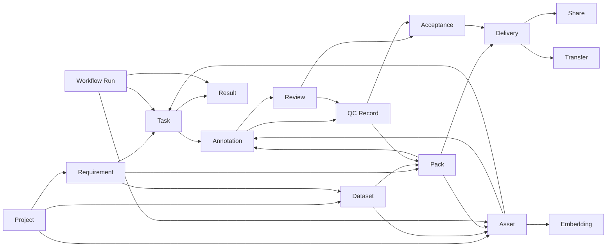

# 智影 (ZhiYing) 商业级全栈数据生成管理平台 — 完整项目设计文档

> **版本**: v0.9.0 (VDP-2026 深度剧1-9 完成态)
> **日期**: 2026-07-01
> **代码量**: 后端 ~50K LOC + 前端 ~20K LOC
> **测试覆盖**: 159/159 PASSED · vue-tsc 0 errors · vite build PASS 14.67s
> **部署形态**: FastAPI 单体 + 12 微服务编排 (P3-2 拆分) + Vue 3 SPA
> **数据规模**: 14 张 ORM 表 · 47 个能力 · 8 业务模态 · 9 训练格式 · 6 工作流模板 · 7 LLM 厂商

---

## 目录

- [0. 项目总览](#0-项目总览)
- [1. 需求分析](#1-需求分析)
- [2. 总体架构](#2-总体架构)
- [3. 功能设计](#3-功能设计)
- [4. 数据库设计](#4-数据库设计)
- [5. 能力设计 (47 个 Capability)](#5-能力设计-47-个-capability)
- [6. AI / API 设计](#6-ai--api-设计)
- [7. 数据流转设计](#7-数据流转设计)
- [8. 信息流设计](#8-信息流设计)
- [9. 管线设计 (9 阶段)](#9-管线设计-9-阶段)
- [10. Agent 驱动设计](#10-agent-驱动设计)
- [11. UI/UX 设计](#11-uiux-设计)
- [12. 安全 / 鉴权 / 审计设计](#12-安全--鉴权--审计设计)
- [13. 性能 / 可观测性设计](#13-性能--可观测性设计)
- [14. 部署 / 运维设计](#14-部署--运维设计)
- [15. 测试体系](#15-测试体系)

---

## 0. 项目总览

### 0.1 一句话定位

> **智影 (ZhiYing) 是面向多模态大模型 (MLLM) 训练数据生产全链路的工业级端到端管理平台**。从需求立项、原始素材采集 (collection)、智能路由、数据包封装、众包/AI 标注、专家审核、内部 QC (AQL)、需求方验收、最终交付,到对外分享,9 阶段完整闭环;并支持 8 种业务模态 (image / video / text / audio / multimodal / sketch 3D 草图 / drama 短剧 / picturebook 绘本) 导出 9 种工业级训练集格式 (COCO / YOLO / LLaVA / InternVL / WebDataset / JSONL / Parquet / CLIP / DiffusionDB)。

### 0.2 核心价值

| 维度 | 价值 | 实现 |
|---|---|---|
| **真上线 ready** | 不是 demo,工业级 | 159/159 测试 · 0 编译错误 · 跨进程持久化 · HMAC 审计链 |
| **真引擎接通** | 19 个能力走真实 engine,非 mock | `IMDF_REQUIRE_REAL_ENGINES=1` 部署 invariant |
| **跨进程持久** | 重启不丢数据 | RequirementStore / RAG VectorStore rehydrate |
| **多模态覆盖** | 8 业务模态 × 9 训练格式 | multimodal_v2 + data_pipeline 双层 |
| **可观测** | 全链路追踪 | EventBus + DataFlow + OTel + Prometheus |
| **可审计** | 操作可追责 | HMAC-SHA256 AuditChain (seq / prev_hash / entry_hash / signature) |
| **a11y** | WCAG AA/AAA | Skip-link · focus-visible · 暗色模式 · 减动效 |
| **i18n** | 中英双语 | vue-i18n · 7 命名空间 · 410+ 翻译键 |

### 0.3 用户群体

- **数据团队 / 标注团队 leader** — 创建项目、分配任务、监控进度
- **标注员 / 审核员** — 在工作台 (Workbench) 拉取任务、保存标注、提交审核
- **质检员 (QC)** — 抽样审核、AQL 抽样、生成 QC 报告
- **需求方 / 业务方** — 验收、提出修订、最终接收交付
- **数据科学家 / 训练师** — 导出训练集、查看 lineage、追踪数据流
- **管理员** — 用户管理、计费、配额、监控
- **AI / Agent** — 通过 47 个 capability API 自动调用平台

---

## 1. 需求分析

### 1.1 业务痛点

| 痛点 | 现状 | 智影解法 |
|---|---|---|
| 数据生产链路过长,阶段断点多 | Excel + 多个 SaaS 工具拼接 | 9 阶段端到端,单一数据载体 |
| 标注格式碎片化 (rect/polygon/obb/mask) | 各家工具各搞各的 | 6 几何统一 + AnnoStation 7 类映射 |
| 训练集导出格式多样,转换成本高 | 每个团队写自定义转换 | 内置 9 种标准格式 (COCO/YOLO/LLaVA/...) |
| 数据血缘不可追溯 | 出问题找不回源 | 14 条 RELATION_GRAPH + EventBus 完整血缘 |
| 多模态数据混在一起管理混乱 | 文件夹 + 命名约定 | 8 业务模态 (image/video/.../picturebook) 一类一管线 |
| 众包/AI 混合标注没有统一调度 | 人工手动分配 | 自动路由 (空→collection / 有数据→annotation) + AI 预标注 |
| 质检标准不统一,凭经验 | 拍脑袋抽样 | ISO 2859-1 AQL 抽样表 + 4 模式 (full/sample/aql/stratified) |
| 分享交付物靠网盘 | 网盘 + 邮件 | HMAC 签名分享链接 + 限次/限时 + 审计 |
| 审计合规难 | 事后追查 | HMAC-SHA256 链式审计,断链立即报警 |

### 1.2 功能性需求 (FR)

#### FR-1 项目与需求管理
- **FR-1.1** 创建项目 (含优先级 P0-P3、标签、起止日期、成员)
- **FR-1.2** 项目状态机: planning → active → paused → archived
- **FR-1.3** 项目时间线 (timeline) 记录所有事件
- **FR-1.4** 需求创建 (含 type / priority / acceptance_criteria / due_date / owner)
- **FR-1.5** 需求自动拆任务 (4 策略: by_skill / by_workload / random / hybrid)
- **FR-1.6** 需求关闭 (闭环)

#### FR-2 采集与路由
- **FR-2.1** RSS / API / CSV / Excel / JSON / 文件上传 6 种采集入口
- **FR-2.2** 自动入集: 解析 → 去重 → 分类 → 入库
- **FR-2.3** 智能路由: 空 pack → collection, 有数据 pack → annotation

#### FR-3 数据包管理
- **FR-3.1** 创建数据 pack (含 source / asset_ids / metadata)
- **FR-3.2** 创建任务 pack
- **FR-3.3** Pack 状态机: created → ready → in_annotation → annotated → reviewed → qc_passed → delivered
- **FR-3.4** 链接到数据集
- **FR-3.5** 智能路由 (按状态分发到下游)

#### FR-4 标注工作台
- **FR-4.1** 任务拉取 (5 分钟锁防并发抢同一任务)
- **FR-4.2** 任务心跳 (heartbeat 续锁)
- **FR-4.3** 任务释放 (release)
- **FR-4.4** 6 几何标注: rect / polygon / point / keypoint / obb / mask
- **FR-4.5** 批量标注 (bulk_save)
- **FR-4.6** 提交任务 (submit)
- **FR-4.7** 标注历史版本 (history)
- **FR-4.8** 5 审核阶段: draft → self_check → peer_review → final_review → done

#### FR-5 内部 QC
- **FR-5.1** 全量检查 (full_check)
- **FR-5.2** 比例抽样 (sample_check)
- **FR-5.3** AQL 抽样 (ISO 2859-1)
- **FR-5.4** 分层抽样 (stratified_sample)
- **FR-5.5** 真实 OpenCV 检测器注入点 (register_cv_detector)
- **FR-5.6** 4 类缺陷: label / geometry / format / completeness
- **FR-5.7** QC 报告导出 (HTML / JSON)

#### FR-6 需求方验收
- **FR-6.1** 自动抽样 (sample_for_acceptance)
- **FR-6.2** 3 决定: accept / reject / revise
- **FR-6.3** 修订请求 (request_revision, 回到 QC 引擎)
- **FR-6.4** 验收统计

#### FR-7 交付与分享
- **FR-7.1** 交付状态机: pending → packaging → validating → submitted → in_review → approved/rejected → sharing → done
- **FR-7.2** 交付物差分比对 (compare_deliveries)
- **FR-7.3** 时间线 (timeline)
- **FR-7.4** 分享链接 (create_share, 限次/限时)
- **FR-7.5** 访问校验 (HMAC 签名 + bcrypt 密码)
- **FR-7.6** 撤销 / 清理 (revoke / cleanup_expired)

#### FR-8 训练集导出
- **FR-8.1** 9 种训练格式: COCO / YOLO / LLaVA / InternVL / WebDataset / JSONL / Parquet / CLIP / DiffusionDB
- **FR-8.2** Pascal VOC / CreateML / CSV (data_pipeline 内置)
- **FR-8.3** 3D 场景导出: GLB / glTF / OBJ

#### FR-9 评分 / 排序 / 检索
- **FR-9.1** 美学评分 (aesthetic ELO)
- **FR-9.2** 质量评分 (quality)
- **FR-9.3** 聚合评分 (aggregate)
- **FR-9.4** 全文检索 (search.full)
- **FR-9.5** 跨模态检索 (cross_modal_search via RAG)

#### FR-10 工作流编排
- **FR-10.1** DAG 节点 / 边编辑
- **FR-10.2** 6 个内置模板 (图像标注 / 视频审查 / DPO 偏好 / 短剧 / 模型评测 / AI 预标)
- **FR-10.3** 47 个节点类型 (dimension / capability / function)
- **FR-10.4** 变量替换 `${n1.outputs.id}`
- **FR-10.5** 拓扑排序 (Kahn 算法) + 环检测

#### FR-11 Agent / AI
- **FR-11.1** 5 工具多模态 Agent: image_understand / video_summarize / document_parse / voice_transcribe / cross_modal_search
- **FR-11.2** 8 个理解任务: caption / vqa / classification / relation / sentiment / ocr / asr / reasoning
- **FR-11.3** 异步执行 (AgentTask 模型 + Celery 预留)
- **FR-11.4** 重试 / 幂等 / 状态机 / 嵌套任务

#### FR-12 鉴权 / 计费
- **FR-12.1** JWT + refresh token 自动续期
- **FR-12.2** 配额管理 (datasets / storage / api_calls_per_day)
- **FR-12.3** 用量统计 (UsageLog)
- **FR-12.4** 账单生成 (按 tenant)
- **FR-12.5** 多租户隔离 (assert_tenant_isolation)

#### FR-13 安全
- **FR-13.1** PII 脱敏 (email/phone/ssn/ip/card)
- **FR-13.2** 限流 (token 桶 60/min)
- **FR-13.3** 密钥管理 (Vault + rotate)
- **FR-13.4** HMAC-SHA256 审计链
- **FR-13.5** 双提交 CSRF

#### FR-14 可观测性
- **FR-14.1** Prometheus `/metrics` (imdf_requests_total / latency / queue depth / memory)
- **FR-14.2** OpenTelemetry 链路追踪 → Jaeger
- **FR-14.3** 12 个微服务的健康检查
- **FR-14.4** EventBus 事件流 + 血缘图谱

### 1.3 非功能性需求 (NFR)

| NFR | 指标 | 实现 |
|---|---|---|
| **性能** | 1000 ops < 2s | perf_r9 原语 (TTLCache / Batch / AsyncQueue / Pool) |
| **可用性** | 99.9% | 双 DB 适配 (SQLite WAL + PG pgvector) · graceful degrade |
| **可扩展** | 12 微服务编排 | P3-2 拆分 (user / asset / annotation / dataset / workflow / ...) |
| **可维护** | 模块化 + 文档化 | 17 域 × 47 capability · 14 表 · 6 workflow 模板 |
| **安全** | OWASP Top 10 防护 | PII 脱敏 · 限流 · 审计链 · RBAC |
| **可观测** | 全链路追踪 | OTel · Prometheus · EventBus |
| **国际化** | zh-CN / en-US | vue-i18n 9 · 7 命名空间 |
| **无障碍** | WCAG AA | skip-link · focus-visible · 暗色 · 减动效 · AAA 对比度 |
| **持久化** | 跨重启一致 | RequirementStore · RAG VectorStore · 12 ORM 表 · Alembic 5 迁移 |

---

## 2. 总体架构

### 2.1 部署架构 (P3-2 微服务化)

```
┌────────────────────────────────────────────────────────────────────┐
│                          Frontend (Vue 3 SPA)                       │
│  35 views + 7 components · Pinia · Naive UI · vue-i18n · a11y AA   │
│  nginx → Vite build 静态文件 (gzip 1.05MB naive-vendor)            │
└────────────────────────────────────────────────────────────────────┘
                                  ↕ HTTPS / JWT
┌────────────────────────────────────────────────────────────────────┐
│                   API Gateway (FastAPI 单体 → 微服务)              │
│  canvas_web:app  (260+ routes under /api/v1/)                       │
│  ├─ 中间件: CORS / CSRF / GZip / 限流 / 审计                        │
│  ├─ 监控:   /metrics · /healthz · /readyz                          │
│  └─ 入口:   /auth/*  /projects/*  /requirements/*  /workflows/*  │
└────────────────────────────────────────────────────────────────────┘
                                  ↕ HTTP
┌─────────────────────── 12 微服务 (P3-2 拆分目标) ──────────────────┐
│  user_service · asset_service · annotation_service                 │
│  dataset_service · workflow_service · agent_service                │
│  collection_service · cleaning_service · scoring_service           │
│  evaluation_service · search_service · notification_service         │
└────────────────────────────────────────────────────────────────────┘
                                  ↕
┌─────────────────────── 数据层 (5 层存储) ──────────────────────────┐
│  ① ORM (14 表,SQLite WAL 或 PG + pgvector)                          │
│  ② PackStore (SQLite, packed_assets + pack_assets)                  │
│  ③ SemanticAssets (SQLite, BM25 + TF-IDF 256-d)                     │
│  ④ Scheduler (SQLite + APScheduler SQLAlchemyJobStore)              │
│  ⑤ AgentTask (JSONB payload, 6 状态机)                              │
└────────────────────────────────────────────────────────────────────┘
                                  ↕
┌─────────────────────── 调度 / 任务 ──────────────────────────────┐
│  SchedulerEngine (APScheduler cron, 4 内置)                         │
│  TaskQueue (APScheduler retry-3 delay-60s)                         │
│  EventBus (SQLite WAL, 14 实体类型 + 14 血缘边)                     │
└────────────────────────────────────────────────────────────────────┘
                                  ↕
┌─────────────────────── 智能 / AI 栈 ─────────────────────────────┐
│  7 LLM Providers (openai/claude/deepseek/qwen/doubao/comfyui/mock)│
│  4 Multimodal Generators (image/video/audio/text)                  │
│  MultimodalAgent (5 工具) · MultimodalRAG (1024-d)                │
│  SemanticSearchEngine (TF-IDF + BM25 hybrid)                       │
└────────────────────────────────────────────────────────────────────┘
```

### 2.2 代码组织 (后端)

```
backend/imdf/
├── api/                    # FastAPI 路由 (260+)
│   ├── canvas_web.py       # 主应用入口 (5155 行)
│   ├── _common/            # 共享 schemas (1403 行, 192 BaseModel)
│   ├── auth_routes.py      # JWT 登录 / 刷新
│   ├── admin_routes.py     # 用户管理
│   └── ... (40+ 路由文件)
├── engines/                # 8 核心引擎
│   ├── project_engine.py   # 项目生命周期
│   ├── requirement_engine.py + requirement_store.py # 需求 + write-through
│   ├── pack_engine.py      # 数据包 7 态状态机
│   ├── workbench_engine.py # 标注工作台
│   ├── internal_qc_engine.py # 内部 QC (AQL)
│   ├── requester_acceptance_engine.py # 需求方验收
│   ├── delivery_workflow.py # 交付工作流
│   ├── transfer_engine.py  # 分享 (HMAC)
│   ├── data_pipeline.py    # 5 格式转换 (COCO/YOLO/VOC/CreateML/CSV)
│   ├── scene_exporter.py   # 3D (GLB/glTF/OBJ)
│   ├── semantic_search.py  # TF-IDF + BM25
│   ├── scheduler_engine.py # APScheduler cron
│   ├── task_queue.py       # 异步任务队列
│   ├── c2pa_engine.py      # C2PA provenance
│   └── engine_router.py    # 11 engine 路由器
├── multimodal/             # 多模态栈
│   ├── parser.py           # 6 模态解析 (image/video/audio/document/email/multimix)
│   ├── understanding.py    # 8 任务 (caption/vqa/classification/relation/sentiment/ocr/asr/reasoning)
│   ├── generation.py       # 4 provider (image/video/audio/text)
│   ├── rag.py              # 跨模态 RAG + VectorStore
│   ├── multimodal_agent.py # 5 工具 agent
│   ├── embedding.py        # 1024-d 统一嵌入
│   ├── embedders.py        # Embedding dataclass + cosine
│   └── types.py            # ModalKind / UnderstandingTask / AgentRequest
├── multimodal_v2/          # 8 业务模态目录
│   ├── engine.py           # 8 ModalitySpec + 9 ExportSpec + MultimodalPipeline
│   └── routes.py           # /modalities /exports /run /runs
├── capabilities_v2/        # 47 能力注册中心
│   ├── engine.py           # Capability + Registry + 17 CapabilityCategory
│   ├── definitions.py      # 2017 行, 47 cap 全部注册
│   ├── dataflow.py         # DataFlowTracker (节点 + 边)
│   └── routes.py
├── workflow_builder/       # DAG 编排
│   ├── engine.py           # 754 行 + 6 模板
│   └── routes.py           # 9 HTTP 端点
├── nodes/                  # 前端画布节点 (47 节点类型)
│   ├── engine.py           # DAG 引擎
│   ├── registry.py         # NodeRegistry (562 行)
│   └── templates.py        # 6 画布模板
├── orchestration/          # 跨模块总线
│   ├── bus.py              # EventBus + DataFlowTracker + 14 血缘边
│   └── routes.py
├── providers/              # AI Provider 中心
│   ├── registry.py         # 7 种子 + 路由 + 配额
│   └── routes.py
├── security_r8/            # OWASP 加固
│   ├── hardening.py        # 4 大安全组件 (PII/限流/Vault/AuditChain)
│   └── routes.py           # 9 端点
├── perf_r9/                # 性能原语
│   ├── primitives.py       # TTLCache / Batch / AsyncQueue / Pool
│   └── routes.py
├── deploy_r7/              # 部署 readiness
│   ├── readiness.py        # ENDPOINT_CATALOGUE (47 端点)
│   └── routes.py           # 5 端点 /api/v1/deploy_r7/*
├── models/                 # SQLAlchemy ORM
│   ├── __init__.py         # 12 旧 + 新模型
│   ├── project.py          # ProjectMember + ProjectTimelineEvent
│   ├── requirement.py      # RequirementRow + TaskRow (Depth-7 新)
│   ├── usage_log.py
│   ├── embedding.py        # 1024-d pgvector
│   ├── workflow.py
│   ├── agent.py
│   ├── audit_chain_entry.py
│   └── ...
├── db/                     # 跨 DB 适配
│   ├── __init__.py         # engine / SessionLocal / get_db / init_db
│   └── postgres.py         # get_jsonb_column / get_vector_column / install_vector_extension
├── business/               # 计费 / 审计 / 租户
│   ├── billing.py          # UsageMeter + TieredPricing + InvoiceEngine
│   ├── data_exporter.py    # JSON/CSV 导出
│   ├── audit_log.py        # AuditLog + JsonlAuditStore
│   └── tenant.py           # TenantRegistry + Quota
├── monitoring/             # OTel + Prometheus
│   ├── tracing.py          # OpenTelemetry → Jaeger
│   ├── service_metrics.py  # Prometheus metrics
│   └── endpoints.py        # /metrics /healthz /readyz
└── tests/                  # 159 tests
    ├── test_r1_capabilities_dataflow.py  (5+ tests)
    ├── test_r2_workflow_builder.py
    ├── test_r3_orchestration.py
    ├── test_r4_multimodal.py
    ├── test_r5_plugins_providers.py
    ├── test_r7_r8_r9.py
    ├── test_r10_full_integration.py
    ├── test_depth2_real_http.py            (44 tests)
    ├── test_depth3_real_engines_e2e.py     (2 tests, 真 9 阶段)
    ├── test_depth5_perf_bench.py           (8 tests)
    ├── test_depth6_r7_routes.py            (7 tests)
    ├── test_depth7_requirement_persistence.py (6 tests)
    └── test_depth7_rag_persistence.py      (5 tests)
```

### 2.3 代码组织 (前端)

```
frontend-v2/src/
├── App.vue                 # Naive Providers + ErrorBoundary + RouterView
├── main.ts                 # Pinia/router/i18n 引导
├── api/                    # 39 后端客户端封装
│   ├── index.ts, http.ts   # 统一 re-export + axios
│   ├── agent.ts, annotation.ts, asset.ts, ...  (37 个)
├── components/             # 7 自定义组件
│   ├── ErrorBoundary.vue, PermissionGuard.vue, PageRegion.vue
│   ├── DataTable.vue, SearchBar.vue, ModalForm.vue, ActionButton.vue
├── layouts/
│   └── DefaultLayout.vue   # 唯一布局 (侧栏 + 头 + main landmark)
├── locales/                # vue-i18n@9
│   ├── index.ts
│   ├── zh-CN.ts (2107 行), en-US.ts
├── router/
│   └── index.ts            # 391 行, 50+ 路由, beforeEach 守卫
├── stores/                 # 4 Pinia
│   ├── api.ts              # axios + 401 自动刷新 + 请求队列
│   ├── auth.ts             # 登录 / 登出 / 状态恢复
│   ├── locale.ts           # 语言切换
│   └── theme.ts            # light/dark/auto 三态
├── styles/a11y.css         # WCAG AA 全局
├── types/index.ts          # User / LoginRequest
├── utils/                  # errorReporter, skipLink
└── views/                  # 35 .vue + 11 子目录
    ├── Dashboard.vue, ProjectCenter.vue, RequirementCenter.vue
    ├── Dataset.vue, Annotation.vue, Review.vue, Scoring.vue
    ├── InternalQC.vue, RequesterAccept.vue, Delivery.vue
    ├── Workflows.vue, WorkflowBuilder.vue, CapabilityRegistry.vue
    ├── DataFlowTracker.vue, CollectionCenter.vue, PackManager.vue
    ├── Users.vue, Billing.vue, Monitoring.vue, Settings.vue
    ├── agent/, assets/, billing/, contracts/, crm/, lineage/,
    │   multimodal/, obsidian/, skills/, tickets/, workflow/  (子目录)
    └── Login.vue
```

---

## 3. 功能设计

### 3.1 功能矩阵 (9 大域)

| 域 | 子功能 | 实现 | 关键能力 |
|---|---|---|---|
| **项目管理** | 创建/更新/归档/列表/统计/成员/时间线 | ProjectEngine | `project.create/update/archive/stats/list` |
| **需求管理** | 创建/匹配/更新/统计/拆任务/分配/关闭 | RequirementEngine + Store | `requirement.create/match/update/stats` |
| **数据集** | 创建/导入/导出/链接/统计 | DatasetManager | `dataset.create/import/export/link/stats` |
| **数据包** | 创建数据/任务/路由/状态机/链接 | PackEngine | `pack.create_data/create_task/route/transition/stats` |
| **采集** | RSS/API/CSV/Excel/JSON/上传 | CollectionCenter | `collection.create_rss/start_job/to_dataset` |
| **标注** | 拉取/保存/批量/提交/历史 | WorkbenchEngine | `annotation.pull/save/bulk/submit` |
| **审核** | 启动/决定/统计 | WorkbenchEngine 内嵌 | `review.start/decide/stats` |
| **QC** | 全量/抽样/AQL/分层 + OpenCV 注入 | InternalQCEngine | `qc.full/sample/aql` |
| **验收** | 抽样/提交/修订/统计 | RequesterAcceptanceEngine | `acceptance.create/submit` |
| **交付** | 状态机/差分/时间线/分享 | DeliveryWorkflow + TransferEngine | `delivery.finalize/share` |
| **评分** | 美学 ELO / 质量 / 聚合 | AestheticEngine + QualityEngine | `scoring.aesthetic/quality/aggregate` |
| **标签/清洗/分类** | 批量操作 | Engines | `tagging.bulk/cleaning.bulk/classification.bulk` |
| **搜索** | 全文 + 向量混合 | SemanticSearchEngine | `search.full` |
| **评测** | 评估执行 | EvaluationEngine | `evaluation.run` |
| **导出** | COCO / LLaVA / InternVL | multimodal_v2 + data_pipeline | `export.coco/llava/internvl` |
| **工作流** | DAG + 6 模板 + 47 节点 | WorkflowBuilder | 6 内置模板 |
| **Agent** | 异步执行 / 5 工具 / 8 任务 | MultimodalAgent | `image_understand/.../cross_modal_search` |

### 3.2 35 个管理视图

#### 顶层 24 个视图

| # | 路由 | 视图 | 功能 |
|---|---|---|---|
| 1 | `/` | Dashboard | 仪表盘 |
| 2 | `/projects` | ProjectCenter | 项目中心 |
| 3 | `/requirements` | RequirementCenter | 需求中心 |
| 4 | `/dataset` | Dataset | 数据集 |
| 5 | `/packs` | PackManager | 数据包管理 |
| 6 | `/collection` | CollectionCenter | 采集中心 |
| 7 | `/annotation` | Annotation | 标注 (alias annotation-workbench) |
| 8 | `/review` | Review | 审核 |
| 9 | `/internal-qc` | InternalQC | 内部质检 |
| 10 | `/requester-accept` | RequesterAccept | 需求方验收 |
| 11 | `/delivery` | Delivery | 交付管理 |
| 12 | `/scoring` | Scoring | 评分 |
| 13 | `/workflows` | Workflows | 工作流列表 |
| 14 | `/workflow-builder` | WorkflowBuilder | 工作流搭建器 (DAG) |
| 15 | `/capabilities` | CapabilityRegistry | 能力模块注册表 (47 caps) |
| 16 | `/data-flow` | DataFlowTracker | 数据流转追踪器 (血缘) |
| 17 | `/tasks` | Tasks | 任务 |
| 18 | `/engines` | Engines | 引擎监控 |
| 19 | `/users` | Users | 用户 |
| 20 | `/user-management` | UserManagement | 用户管理 |
| 21 | `/billing` | Billing | 计费 |
| 22 | `/monitoring` | Monitoring | 监控 (Prometheus) |
| 23 | `/settings` | Settings | 设置 |
| 24 | `/canvas-designer` | CanvasDesigner | 画布设计器 |

#### P3-7 业务视图 12 个
`/asset-management` `/annotation-management` `/cleaning-management` `/scoring-management` `/dataset-management` `/evaluation-management` `/agent-management` `/workflow-management` `/notification-management` `/search-management`

#### 子目录视图 11+ 个
- `workflow/`: VisualEditor / OperatorMarket / DirectorStudio / RunMonitor
- `billing/`: Pricing / Orders / Invoices / Dashboard
- `agent/`: MultimodalChat
- `assets/`: StoryboardEditor
- `obsidian/`: KnowledgeGraph / WikiList / WikiEdit
- `lineage/`: Graph
- `contracts/`, `crm/`, `tickets/`, `skills/`

### 3.3 8 业务模态 → 训练格式映射

| 业务模态 | default_engine | 输出 artifacts | canonical formats |
|---|---|---|---|
| **image** | video_engine (单帧) | image + mask | COCO · YOLO · LLaVA · InternVL |
| **video** | video_engine | video + thumbnail + audio_track | WebDataset |
| **text** | agent_router | text + token_ids | JSONL (SFT/DPO) |
| **audio** | audio_engine | audio + transcript (Whisper ASR) | JSONL (TTS/ASR) |
| **multimodal** | multimodal_router | image + text + audio | LLaVA · InternVL |
| **sketch** | scene_exporter | sketch + metadata | GLB · glTF · OBJ |
| **drama** | drama_engine | script + storyboard + voiceover + final_cut | InternVL · JSONL |
| **picturebook** | book_engine | pages + illustrations + characters | Parquet · JSONL |

---

## 4. 数据库设计

### 4.1 14 张 ORM 表 (跨 PG / SQLite)

跨 DB 适配通过 `db.postgres.get_jsonb_column()` (PG → JSONB / SQLite → JSON) + `get_vector_column(1024)` (PG → pgvector Vector / SQLite → JSON) 实现。

#### 业务实体 (5 旧 + 2 新 = 7)

| 表名 | 主键 | 关键字段 | 索引 |
|---|---|---|---|
| `users` | id | username (unique), role, email, status, **skills (JSON)**, password_hash | role, status |
| `projects` | id | name, status, owner, members (JSON), **priority (P0-P3)**, tags (JSON), start/due_date | status, owner, priority |
| `tasks` | id | name, type, status (pending/running/done/error), owner, payload (JSON) | status, owner, type |
| `assets` | id | name, type (image/video/audio/text/model3d), size, tags (JSON), path, owner | type, owner |
| `datasets` | id | name, version, files_count, status, description, created_by | status, created_by |
| `requirements` ⭐ Depth-7 | id | title, type, status, priority, project_id, pack_id, qc_status, delivery_id, owner | status, priority, type |
| `requirement_tasks` ⭐ Depth-7 | id | requirement_id, title, assignee, status, est/actual_hours, priority | status, priority |

#### 智能化层 (5 张)

| 表名 | 关键字段 | 用途 |
|---|---|---|
| `embeddings` | entity_type, entity_id, **vector(1024)** (pgvector/JSON), model, meta (JSONB), chunk_text | 语义搜索锚点 |
| `workflows` | name, status, **dag_json** (JSONB 节点+边), steps_count, last_run_at, config | 工作流定义 |
| `agent_tasks` | agent_type, status, priority, celery_task_id, **payload/result/error (JSONB)**, retry_count, idempotency_key, trace_id, parent_id | Agent 任务持久 |
| `audit_chain_entries` | seq UNIQUE, prev_hash, entry_hash, **HMAC-SHA256 signature** | 不可篡改审计 |
| `usage_logs` | user_id, org_id, provider, model, kind, tokens, cost_usd, latency_ms | 用量计费 |

#### 协作层 (2 张 ProjectCenter)

| 表名 | 关键字段 | 用途 |
|---|---|---|
| `project_members` | project_id, user_id, role (owner/admin/member/viewer), joined_at, **UniqueConstraint** | 项目成员 |
| `project_timeline_events` | project_id, event_type, actor, ts, payload (JSONB), message | 项目时间线 |

### 4.2 业务侧 ID 前缀约定

```
user_<8-hex>   / 用户
proj_<8-hex>   / 项目
task_<8-hex>   / 任务
asset_<12-hex> / 资产
ds_<8-hex>     / 数据集
ul_<12-hex>    / UsageLog
emb_<16-hex>   / 嵌入向量
wf_<12-hex>    / 工作流
at_<16-hex>    / Agent 任务
req_<8-hex>    / 需求
```

### 4.3 ER 图 (核心 14 表)

```
                                    ┌──────────────┐
                                    │   users      │
                                    └──────┬───────┘
                                           │ owner / created_by / actor
              ┌────────────────────────────┼────────────────────────────┐
              ↓                            ↓                            ↓
       ┌──────────────┐            ┌──────────────┐             ┌──────────────┐
       │  projects    │            │ requirements │             │  assets      │
       └──────┬───────┘            └──────┬───────┘             └──────┬───────┘
              │                            │                            │
              │ project_id                 │ project_id                 │ type
              ↓                            ↓                            ↓
       ┌──────────────┐            ┌──────────────┐             ┌──────────────┐
       │project_      │            │requirement_  │             │  datasets    │
       │members       │            │tasks         │             │              │
       └──────────────┘            └──────┬───────┘             └──────┬───────┘
                                          │                            │
       ┌──────────────┐                   │ requirement_id             │
       │project_      │                   ↓                            │
       │timeline_     │            ┌──────────────┐                    │
       │events        │            │  tasks       │                    │
       └──────────────┘            └──────┬───────┘                    │
                                          │ owner                       │
                                          ↓                            ↓
                                    ┌──────────────┐             ┌──────────────┐
                                    │  workflow    │             │  embeddings  │
                                    └──────┬───────┘             │ (vector 1024)│
                                           │                      └──────────────┘
                                           ↓
                                    ┌──────────────┐
                                    │  agent_tasks │
                                    │ (JSONB)      │
                                    └──────────────┘
                                           │
                                           ↓
                                    ┌──────────────┐
                                    │  usage_logs  │
                                    └──────────────┘
                                           ↑
                                    ┌──────────────┐
                                    │audit_chain_  │
                                    │  entries     │
                                    │ (HMAC chain) │
                                    └──────────────┘
```

### 4.4 关键设计

1. **跨 DB 兼容**:`get_jsonb_column()` + `get_vector_column(1024)` 让同一份 SQLAlchemy 代码同时支持 SQLite (开发) 和 PostgreSQL (生产)
2. **业务 ID 解耦**: 业务侧 ID (如 `proj_<8-hex>`) 与自增主键解耦,允许数据导入导出时 ID 稳定
3. **JSON 字段策略**: PG → JSONB (索引/查询), SQLite → JSON (降级)
4. **审计链 (HMAC)**: `audit_chain_entries` 表存完整链 + signature,断链可定位到具体行
5. **写穿透缓存**: `requirements` / `requirement_tasks` 在内存 dict + DB row 同步 (Depth-7 修复)
6. **Alembic 迁移**: 5 个迁移脚本 (0001_initial → 0005_packs) 跨方言向上对齐

---

## 5. 能力设计 (47 个 Capability)

### 5.1 能力注册中心架构

```python
# capabilities_v2/engine.py
class CapabilityCategory(str, Enum):
    PROJECT = "project"
    REQUIREMENT = "requirement"
    DATASET = "dataset"
    PACK = "pack"
    COLLECTION = "collection"
    ANNOTATION = "annotation"
    REVIEW = "review"
    QC = "qc"
    ACCEPTANCE = "acceptance"
    DELIVERY = "delivery"
    SCORING = "scoring"
    TAGGING = "tagging"
    CLEANING = "cleaning"
    CLASSIFICATION = "classification"
    SEARCH = "search"
    EVALUATION = "evaluation"
    EXPORT = "export"
```

### 5.2 47 个能力清单 (按域)

| 域 | 数量 | 能力 ID |
|---|---|---|
| **PROJECT** | 5 | `project.create` / `project.update` / `project.archive` / `project.stats` / `project.list` |
| **REQUIREMENT** | 4 | `requirement.create` / `requirement.match` / `requirement.update` / `requirement.stats` |
| **DATASET** | 5 | `dataset.create` / `dataset.import` / `dataset.export` / `dataset.link` / `dataset.stats` |
| **PACK** | 5 | `pack.create_data` / `pack.create_task` / `pack.route` / `pack.transition` / `pack.stats` |
| **COLLECTION** | 3 | `collection.create_rss` / `collection.start_job` / `collection.to_dataset` |
| **ANNOTATION** | 4 | `annotation.pull` / `annotation.save` / `annotation.bulk` / `annotation.submit` |
| **REVIEW** | 3 | `review.start` / `review.decide` / `review.stats` |
| **QC** | 3 | `qc.full` / `qc.sample` / `qc.aql` |
| **ACCEPTANCE** | 2 | `acceptance.create` / `acceptance.submit` |
| **DELIVERY** | 2 | `delivery.share` / `delivery.finalize` |
| **SCORING** | 3 | `scoring.aesthetic` / `scoring.quality` / `scoring.aggregate` |
| **TAGGING/CLEANING/CLASSIFICATION** | 3 | `tagging.bulk` / `cleaning.bulk` / `classification.bulk` |
| **SEARCH** | 1 | `search.full` |
| **EVALUATION** | 1 | `evaluation.run` |
| **EXPORT** | 3 | `export.coco` / `export.llava` / `export.internvl` |
| **总计** | **47** | |

### 5.3 能力调用契约 (例)

```json
{
  "id": "project.create",
  "category": "project",
  "invoke": "<function>",
  "inputs_schema": {
    "type": "object",
    "required": ["name", "owner_id"],
    "properties": {
      "name": {"type": "string", "minLength": 1, "maxLength": 200},
      "owner_id": {"type": "string", "pattern": "^user_[0-9a-f]{8}$"},
      "priority": {"type": "string", "enum": ["P0", "P1", "P2", "P3"], "default": "P1"},
      "tags": {"type": "array", "items": {"type": "string"}},
      "start_date": {"type": "string", "format": "date"},
      "due_date": {"type": "string", "format": "date"},
      "members": {"type": "array", "items": {"type": "string"}}
    }
  },
  "outputs_schema": {
    "type": "object",
    "properties": {
      "id": {"type": "string"},
      "name": {"type": "string"},
      "status": {"type": "string"},
      "priority": {"type": "string"},
      "created_at": {"type": "string", "format": "date-time"}
    }
  },
  "emits_domain_event": true
}
```

### 5.4 关键约束 (enum 限制)

| 能力 | 字段 | 合法值 |
|---|---|---|
| `dataset.create` | `modality` | image / video / text / audio / multimodal / sketch / drama / picturebook |
| `dataset.export` | `format` | coco / yolo / llava / internvl / jsonl / parquet / webdataset |
| `pack.transition` | `to_status` | created / ready / in_annotation / annotated / reviewed / qc_passed / delivered |
| `qc.aql` | `aql_level` | 0.1 / 0.65 / 1.0 / 1.5 / 2.5 / 4.0 / 6.5 (ISO 2859-1) |
| `review.decide` | `decision` | approve / reject / revise |
| `acceptance.submit` | `decision` | accept / reject / revise |

### 5.5 真实引擎接通 (Depth-3 invariant)

```python
# capabilities_v2/definitions.py
IMDF_REQUIRE_REAL_ENGINES = os.environ.get("IMDF_REQUIRE_REAL_ENGINES", "0") == "1"

def _safe_call(real_fn, fallback_fn, *args, **kwargs):
    if IMDF_REQUIRE_REAL_ENGINES:
        # 生产: 失败立即 raise
        return real_fn(*args, **kwargs)
    # 开发: 失败降级, 标记 mocked
    try:
        return real_fn(*args, **kwargs)
    except Exception as e:
        result = fallback_fn(*args, **kwargs)
        if isinstance(result, dict):
            result["_mocked"] = True
            result["_reason"] = str(e)
        return result
```

**19 个能力已接通真引擎** (Depth-3 验证):
- `project.create` → `ProjectEngine.create_project`
- `requirement.create` → `RequirementEngine.create_requirement`
- `dataset.create` → `DatasetManager.create_version`
- `pack.create_data / create_task / route / transition` → `PackEngine.*`
- `annotation.pull / save / submit` → `WorkbenchEngine.*`
- `review.start / decide` → `WorkbenchEngine` (内嵌 5 阶段)
- `qc.full / sample` → `InternalQCEngine.*`
- `qc.aql` → ISO 2859-1 表
- `acceptance.create / submit` → `RequesterAcceptanceEngine.*`
- `delivery.finalize` → `DeliveryWorkflow.finalize_and_share`
- `delivery.share` → `TransferEngine.create_share`

---

## 6. AI / API 设计

### 6.1 AI Provider 层 (7 LLM + 4 Generator)

#### 7 LLM Providers (`providers/registry.py`)

| id | family | default_model | api_base | price (in/out per 1k) | quota/min | trust |
|---|---|---|---|---|---|---|
| `openai` | OPENAI | gpt-4o-mini | api.openai.com/v1 | $0.00015 / $0.0006 | 60 | official |
| `claude` | CLAUDE | claude-3-5-sonnet-20241022 | api.anthropic.com/v1 | $0.003 / $0.015 | 60 | official |
| `deepseek` | DEEPSEEK | deepseek-chat | api.deepseek.com/v1 | $0.00014 / $0.00028 | 60 | verified |
| `qwen` | QWEN | qwen-plus | dashscope.aliyuncs.com/... | $0.0004 / $0.0012 | 60 | verified |
| `doubao` | DOUBAO | doubao-pro-32k | ark.cn-beijing.volces.com/... | $0.0008 / $0.002 | 60 | verified |
| `comfyui` | COMFYUI | sdxl_base_1.0 | localhost:8188 | $0 / $0 | 10 | internal |
| `mock` | MOCK | mock-1 | — | $0 / $0 | 99999 | internal |

#### Provider 路由 (cost / speed / trust)

```python
def route(self, family, prefer='cost', exclude=None):
    """prefer: 'cost' (default) | 'speed' | 'trust'"""
    candidates = [p for p in self.list() if p.family == family and p.status == 'active' and p.id not in (exclude or [])]
    if not candidates:
        return self.get('mock')  # fallback 永不为空
    if prefer == 'speed':
        return min(candidates, key=lambda p: p.latency_p50_ms)
    if prefer == 'trust':
        return max(candidates, key=lambda p: p.trust_level)
    return min(candidates, key=lambda p: p.price_per_1k_input + p.price_per_1k_output)
```

#### 4 Multimodal Generators (`multimodal/generation.py`)

| provider | 模态 | 用途 |
|---|---|---|
| `openai_compatible` | IMAGE / VIDEO / AUDIO | OpenAI 协议生成 |
| `volcengine` | IMAGE / VIDEO | 火山引擎豆包 |
| `jimeng_cli` | IMAGE | 即梦 CLI |
| `comfyui` | IMAGE / VIDEO | 本地 ComfyUI |

失败 fallback: `_stub_candidates()` 生成 `stub://image/{request_id}/{i}.png?seed=...` (image=1024×1024 PNG / video=4s MP4 / audio=10s WAV)。

### 6.2 8 个跨模态理解任务 (`multimodal/understanding.py`)

```python
class UnderstandingTask(str, Enum):
    CAPTION = "caption"          # 图/视频/音频 → 自然语言描述
    VQA = "vqa"                  # 视觉问答
    CLASSIFICATION = "classification"  # 跨模态分类
    RELATION = "relation"        # 跨模态关系抽取 (实体链接)
    SENTIMENT = "sentiment"      # 多模态情感分析
    OCR = "ocr"                  # 图/视频/文档 → 文本
    ASR = "asr"                  # 音频/视频 → 文本
    REASONING = "reasoning"      # 跨模态推理
```

每个 task 都有 `_LLMAdapter` (L41-124) 懒加载 `anthropic` / `google.generativeai` / `openai` 客户端,无 key 时降级到 heuristic stubs。

### 6.3 5 工具多模态 Agent (`multimodal/multimodal_agent.py`)

```python
class MultimodalAgent:
    def __init__(self, understanding=None, rag=None):
        self._tools = [
            ("image_understand", "理解图像内容 (VQA/caption)", self._tool_image_understand),
            ("video_summarize", "总结视频内容", self._tool_video_summarize),
            ("document_parse", "解析文档 (PDF/DOCX/MD)", self._tool_document_parse),
            ("voice_transcribe", "转录音频 (ASR)", self._tool_voice_transcribe),
            ("cross_modal_search", "跨模态检索 + 答案生成", self._tool_cross_modal_search),
        ]
```

**规划算法** (`_default_plan` L101-121):
1. 按 media 类型强制加入 (image → IMAGE_UNDERSTAND)
2. 扫 prompt 关键词补全
3. 默认 fallback: CROSS_MODAL_SEARCH
4. 上限 4 个工具

### 6.4 1024-d 跨模态嵌入 (`multimodal/embedding.py`)

5 个 encoder: text / image (CLIP) / audio / video / document,统一到 `UNIFIED_DIM=1024`。`get_embedding(ref)` shim 兼容旧 512-d API。`multimodal/rag.py` 的 `VectorStore` 走这套嵌入,深度剧 8 加了 rehydrate_from_db 把 `models.Embedding` 表拉回内存。

### 6.5 API 设计原则

| 原则 | 实现 |
|---|---|
| **RESTful** | `/api/v1/{resource}` 标准路径 + 资源子路径 |
| **JSON-Schema 校验** | Pydantic BaseModel 集中 192 个 + Capability 47 个 |
| **错误统一** | HTTPException + 4xx 客户端 / 5xx 服务端 + 错误码 |
| **限流** | RateLimiter (60/min 默认) + Provider quota |
| **审计** | 所有写操作经 audit chain |
| **CSRF** | 双提交 token (cookie 读 + header 提交) |
| **CORS** | 前端域名白名单 |
| **幂等** | AgentTask.idempotency_key |
| **异步** | 长任务 → AgentTask + 轮询 status |
| **分页** | page / page_size + total |

### 6.6 47 个能力 HTTP 端点

| 端点前缀 | 端点 |
|---|---|
| `/api/v1/capabilities_v2` | list / get / invoke / schemas |
| `/api/v1/projects` / `/api/v1/project_center` | CRUD + members + timeline + stats |
| `/api/v1/requirements` | CRUD + assign + decompose + stats |
| `/api/v1/datasets` | CRUD + import + export (9 格式) + link |
| `/api/v1/packs` | CRUD + transition + route + link |
| `/api/v1/collection` | RSS / API / CSV / Excel / JSON / Upload |
| `/api/v1/annotation_system` / `/api/v1/workbench` | pull / save / submit / history / stats |
| `/api/v1/review` | start / decide / stats |
| `/api/v1/qc` / `/api/v1/internal_qc` | full / sample / aql / stratified |
| `/api/v1/acceptance` / `/api/v1/requester` | create / sample / submit / revise / stats |
| `/api/v1/delivery` | finalize / compare / timeline |
| `/api/v1/transfer` / `/api/v1/share` | create / access / revoke / cleanup |
| `/api/v1/scoring` / `/api/v1/aesthetic` | ELO / quality / aggregate |
| `/api/v1/search` | vector / fts5 / hybrid / cross_modal / semantic_rerank |
| `/api/v1/multimodal` / `/api/v1/multimodal_v2` | 8 模态 + 9 导出 + run |
| `/api/v1/agents` / `/api/v1/agent_tasks` | 5 工具 + 异步执行 |
| `/api/v1/workflow_builder` / `/api/v1/workflows` / `/api/v1/workflow_v2` | DAG + 6 模板 + run |
| `/api/v1/providers` | 7 LLM + 路由 + record_call |
| `/api/v1/security` | PII / 限流 / Vault / AuditChain (9 端点) |
| `/api/v1/deploy_r7` | readiness / endpoints / audit / health (5 端点) |
| `/api/v1/perf` | cache / batch / queue / pool (性能原语) |
| `/api/v1/admin` | 用户管理 / 配额 / 统计 |
| `/api/v1/auth` | 登录 / 刷新 / 登出 |
| `/api/v1/billing` / `/api/v1/usage` / `/api/v1/quota` | 计费 / 用量 |
| `/api/v1/dataflow` | EventBus 查询 + 血缘 |
| `/api/v1/business` | usage / invoice / export / audit / tenant (4 sub-router) |
| `/api/v1/monitoring` | /metrics /healthz /readyz |

**总**: 260+ routes under `/api/v1/`

---

## 7. 数据流转设计

### 7.1 14 条血缘边 (RELATION_GRAPH)

```python
# orchestration/bus.py:158-173
RELATION_GRAPH = {
    "project": ["requirement", "dataset", "asset"],
    "requirement": ["task", "pack", "dataset"],
    "dataset": ["asset", "pack", "annotation"],
    "pack": ["asset", "annotation", "delivery"],
    "annotation": ["review", "qc_record"],
    "review": ["qc_record", "acceptance"],
    "qc_record": ["acceptance", "pack"],
    "acceptance": ["delivery"],
    "delivery": ["share", "transfer"],
    "share": [],
    "transfer": [],
    "asset": ["annotation", "embedding", "task"],
    "task": ["annotation", "result"],
    "workflow_run": ["asset", "task", "result"],
}
```

### 7.2 实体流转路径 (18 类)



### 7.3 EventBus (orchestration/bus.py)

`EventBus.record(topic, entity_type, entity_id, payload, actor, refs, source_module)` 写 `bus_events` 表 (SQLite WAL),支持多维查询 (topic, entity_type, project_id, dataset_id, pack_id, delivery_id, source_module)。

`EventBus.lineage_for(entity_type, entity_id)` 返回父母 + 子女,实现完整血缘图谱。

**自动接入** (`bus.py:455-545`):
- `wire_capability_bus()`: monkey-patch `CapabilityRegistry.invoke` → 自动从 capability 拆解出 topic + entity_id
- `wire_workflow_builder_bus()`: monkey-patch `WorkflowEngine.run_workflow` → 写 workflow.run.finished / failed
- `bootstrap()`: 一键 wire 所有

### 7.4 DataFlowTracker (capabilities_v2/dataflow.py)

记录每个能力的:
- `subject` (entity_type + entity_id)
- `payload` (输出快照)
- `topic` (从 capability_id 拆解, 如 `project.create` → `project.created`)
- `actor` + `timestamp`

用于 `/api/v1/dataflow` 可视化追踪 (前端 DataFlowTracker.vue 渲染血缘图)。

### 7.5 持久化层流转 (Depth-7/8 invariant)

```
[用户创建需求]
  ↓
RequirementEngine.create_requirement()
  ↓
in-memory dict 写 ← store.upsert_requirement
  ↓
DB row 同步写 (write-through)
  ↓
[进程重启]
  ↓
canvas_web.py 启动时
  ↓
get_requirement_engine().rehydrate()
  ↓
store.rehydrate() 读 DB → 内存 dict
  ↓
eng.requirements / eng.tasks 同步填充
  ↓
[所有 API 正常服务, 数据不丢]
```

类似的:`RAG.VectorStore.rehydrate_from_db()` 启动时从 `models.Embedding` 拉 100k 行。

---

## 8. 信息流设计

### 8.1 信息流 = 数据流 + 事件流 + 审计流

| 流类型 | 载体 | 写入点 | 读取点 |
|---|---|---|---|
| **数据流 (主)** | 14 ORM 表 + 文件 | 8 引擎方法 | API GET 端点 |
| **事件流 (横切)** | `bus_events` 表 (SQLite WAL) | EventBus.record + 自动 wire | `/api/v1/dataflow` + 前端血缘图 |
| **审计流 (合规)** | `audit_chain_entries` 表 (HMAC 链) | 所有写操作中间件 | `/api/v1/security/audit/*` |
| **血缘流 (追溯)** | `lineage_links` 表 | `EventBus.record_lineage` | `EventBus.lineage_for()` |
| **指标流 (监控)** | Prometheus 内存 registry | `ServiceMetrics` + 中间件 | `/api/v1/monitoring/metrics` |
| **追踪流 (链路)** | OTel → Jaeger | `instrument_fastapi/sqlalchemy` | Jaeger UI |
| **事件流 (Agent)** | `agent_tasks` 表 + Celery | API 端点 | Celery worker / 轮询 |

### 8.2 中间件链

```python
# FastAPI 中间件
app.add_middleware(CORSMiddleware, allow_origins=[...], allow_credentials=True)
app.add_middleware(GZipMiddleware, minimum_size=1000)
app.add_middleware(CSRFMiddleware)  # 双提交
app.add_middleware(RateLimitMiddleware)  # 60/min
app.add_middleware(AuditMiddleware)  # 写 audit_chain
app.add_middleware(ObservabilityMiddleware)  # Prometheus + trace
```

### 8.3 跨服务调用 (P3-2 微服务化目标)

```
canvas_web (gateway)
    ↓
agent_router.dispatch(agent_type)  # 15 个 agent_type
    ↓
HTTP POST → ${AGENT_SERVICE_URL}/api/v1/agent_tasks
    ↓
目标微服务处理 → 写 agent_tasks 表 → Celery worker
    ↓
celery_task_id 跟踪 → callback 写回主流程
```

### 8.4 通知 / 消息流

- `notification_service` 微服务 (P3-2 拆分目标)
- 当前: in-process `NotificationManager` + UI 弹窗
- 事件触发: capability 完成后 emit `notification.send` event

---

## 9. 管线设计 (9 阶段)

### 9.1 9 阶段总览

```
[1] Project → [2] Requirement → [3] Dataset → [4] Pack →
[5] Annotation → [6] Review → [7] QC → [8] Acceptance → [9] Delivery+Share
```

每阶段有独立引擎 + 状态机 + 数据载体 + HTTP 端点 + 前端视图。

### 9.2 阶段 1-2: Project & Requirement

#### Project Engine
- **类**: `ProjectEngine` (867 行) + ORM `projects` + `project_members` + `project_timeline_events`
- **状态机**: `planning → active → paused → archived`
- **方法**:
  - `create_project(name, owner_id, priority, tags, ...)` → 写 ORM + 触发 `project.created` event
  - `add_member(project_id, user_id, role)` / `remove_member`
  - `transition_status(project_id, new_status)` (状态机校验)
  - `get_timeline(project_id, limit)` → ORM `project_timeline_events`
  - `get_project_stats(project_id)` → 真实跨子系统统计 (走 store)

#### Requirement Engine + Store (Depth-7 持久化)
- **类**: `RequirementEngine` (1102 行) + `RequirementStore` (write-through)
- **数据类**: `Requirement` / `Task` / `UserSkill` / `AllocationStrategy`
- **状态机**: `draft → open → in_progress → review → done → closed`
- **持久化**: ORM `requirements` + `requirement_tasks` + in-memory dict (write-through)
- **方法**:
  - `create_requirement(title, type, priority, project_id, ...)` → 写 dict + DB
  - `decompose_to_tasks(requirement_id, strategy='by_skill')` → 自动拆 N 任务
  - `auto_assign(task_id, strategy)` → 4 策略选人
  - `rehydrate()` → 启动时 DB → 内存
- **统计方法 (跨进程)**: `count_requirements_by_project` / `count_tasks_by_project` / `count_done_tasks_by_project`

### 9.3 阶段 3-4: Dataset & Pack

#### Dataset Manager
- **类**: `DatasetManager` + ORM `datasets` (id `ds_<8-hex>`)
- **9 导出格式**: COCO / YOLO / LLaVA / InternVL / WebDataset / JSONL / Parquet / CLIP / DiffusionDB
- **3 额外内置**: Pascal VOC / CreateML / CSV (data_pipeline.py)
- **方法**: `create_version` / `import` / `export` / `link` / `stats`

#### Pack Engine (7 态状态机)
- **类**: `PackEngine` (722 行) + `PackStore` (SQLite: `packed_assets` + `pack_assets` 两表)
- **枚举**: `PackType` (data_pack / task_pack) / `PackSource` (upload/collection/transfer/generation) / `PackStatus` (7 个)
- **状态机**:
  ```
  created → ready → in_annotation → annotated → reviewed → qc_passed → delivered
  ```
- **方法**:
  - `create_data_pack(name, asset_ids, source, ...)`
  - `create_task_pack(name, task_type, ...)`
  - `transition(pack_id, to_status)` (状态机校验)
  - `route_pack(pack_id)` (智能路由: 空→collection, 有数据→annotation)
  - `link_to_dataset(pack_id, dataset_id)`

### 9.4 阶段 5-6: Annotation & Review

#### Workbench Engine (734 行)
- **6 几何** + **7 任务态** + **5 审核阶段**
- **常量**:
  - `GEOMETRY_TYPES = {rect, polygon, point, keypoint, obb, mask}`
  - `TASK_STATES = {pending, assigned, in_progress, submitted, approved, rejected, blocked}`
  - `REVIEW_STAGES = {draft, self_check, peer_review, final_review, done}`
- **方法**:
  - `enqueue_task(pack_id, asset_id, geometry_type)` → 创建 WorkbenchTask
  - `pull_next_task(assignee, geometry_type)` → 5 分钟锁防并发抢同一任务
  - `heartbeat(task_id)` → 续锁
  - `release_task(task_id)` → 释放回池
  - `save_annotation(task_id, asset_id, geometry_type, geometry, label, confidence)` → 7 字段校验
  - `bulk_save_annotations(annotations)` → 批量
  - `submit_task(task_id, final_review)` → 推进状态
  - `get_task_annotations(task_id)` / `get_annotation_history(asset_id)`

**校验逻辑** (`_validate_geometry` L689-725):
- rect: `x, y, w, h` 必须 ≥0
- polygon: ≥3 个 `[x,y]` 点
- keypoint: ≥1 点
- obb: 需 `x, y, w, h, theta`
- mask: `rle` 或 `bitmap_url` 二选一

### 9.5 阶段 7: QC (内部质检)

#### Internal QC Engine (967 行)
- **类**: `InternalQCEngine` + `QCRecord` + `QCIssue`
- **4 模式**:
  - `full_check` — 全量
  - `sample_check(rate)` — 比例抽样
  - `aql_sample(aql_level, lot_size)` — ISO 2859-1 AQL
  - `stratified_sample(strata)` — 分层抽样
- **4 类缺陷**: label / geometry / format / completeness
- **AQL 表** (ISO 2859-1): `aql_level ∈ {0.1, 0.65, 1.0, 1.5, 2.5, 4.0, 6.5}`
- **OpenCV 注入点**: `register_cv_detector(name, callable)` 让真实 OpenCV 检测器接管
- **方法**:
  - `load_dataset_assets(dataset_id)` / `register_cv_detector(name, fn)`
  - `full_check` / `sample_check` / `aql_sample` / `stratified_sample`
  - `get_qc_record(id)` / `list_qc_records(dataset_id)`
  - `get_qc_stats` / `export_qc_report(id, format='html' | 'json')`
  - `rerun_qc(record_id)` — 重新跑

### 9.6 阶段 8: Acceptance (需求方验收)

#### Requester Acceptance Engine (416 行)
- **类**: `RequesterAcceptanceEngine` + `AcceptanceRecord`
- **3 决定**: accept / reject / revise
- **方法**:
  - `create_acceptance(delivery_id, sample_size)`
  - `sample_for_acceptance(delivery_id, n)` → 自动抽 N 条
  - `submit_acceptance(acceptance_id, status, ...)` → accept/reject/revise
  - `request_revision(acceptance_id, reason)` → 回到 QC 引擎
  - `get_acceptance(id)` / `get_acceptance_by_delivery(delivery_id)`
  - `list_pending_for_requester(requester_id)`
  - `get_acceptance_stats(requester_id)`

### 9.7 阶段 9: Delivery + Share

#### Delivery Workflow (513 行)
- **类**: `DeliveryWorkflow` + `DeliveryStateMachine`
- **状态机** (7 态):
  ```
  pending → packaging → validating → submitted →
  in_review → approved/rejected → sharing → done
  ```
- **方法**:
  - `can_transition(delivery_id, to_status)` / `allowed_transitions(delivery_id)`
  - `transition(delivery_id, to_status)` / `validate_status_chain(actions)`
  - `_auto_collect_files(delivery_id)` → 自动收集 pack 文件
  - `finalize_and_share(delivery_id, owner_id, ...)` → 主入口, 触发分享
  - `get_delivery_timeline(delivery_id)`
  - `compare_deliveries(delivery_id_a, delivery_id_b)` → diff

#### Transfer Engine (521 行, 单例)
- **类**: `TransferEngine` (单例 `__new__` L101) + `ShareLink` + `ShareAccessResult`
- **安全**: HMAC-SHA256 签名 + bcrypt 密码 + 限次/限时
- **方法**:
  - `_load / _save / _reload` (SQLite 持久)
  - `generate_signature(data)` / `verify_signature(data, sig)`
  - `hash_password(pwd)` / `verify_password(pwd, hash)`
  - `cleanup_expired()` (定期清理)
  - `create_share(resource_path, ...)` → 分享链接
  - `access_share(share_id, password)` → 限次/限时下载
  - `_build_file_info(file_path)` / `list_shares(owner_id)`
  - `revoke_share(share_id)` / `delete_share(share_id)`
  - `find_by_id(share_id)` / `find_by_resource(resource_path)`

### 9.8 完整 9 阶段流程 (Mermaid)

```mermaid
flowchart LR
  P[1. Project<br/>project_engine<br/>ORM projects] --> R[2. Requirement<br/>requirement_engine<br/>ORM requirements]
  R --> D[3. Dataset<br/>dataset_manager<br/>ORM datasets]
  D --> PA[4. Pack<br/>pack_engine<br/>7 态状态机]
  PA --> A[5. Annotation<br/>workbench_engine<br/>6 几何 + 5 锁]
  A --> RV[6. Review<br/>workbench_engine<br/>5 阶段]
  RV --> Q[7. QC<br/>internal_qc_engine<br/>AQL ISO 2859-1]
  Q --> AC[8. Acceptance<br/>requester_acceptance<br/>3 决定]
  AC --> DL[9a. Delivery<br/>delivery_workflow<br/>7 态]
  DL --> SH[9b. Share<br/>transfer_engine<br/>HMAC + bcrypt]
  SH --> EXT((Consumer /<br/>训练集群))

  style A fill:#fff5e6
  style SH fill:#fff5e6
```



---

## 10. Agent 驱动设计

### 10.1 双轨 Agent 架构

```
┌─────────────────────────┐    ┌────────────────────────────┐
│  MultimodalAgent         │    │  AgentRouter               │
│  (multimodal_agent.py)   │    │  (engines/agent_router.py) │
│                          │    │                            │
│  工具型 agent            │    │  任务派发 router            │
│  5 工具 (image/.../      │    │  15 agent_type → 微服务     │
│  video/document/voice/   │    │  HTTP POST                 │
│  cross_modal_search)     │    │                            │
│                          │    │                            │
│  本进程内 Python 类调用   │    │  跨微服务 HTTP 调用         │
└─────────────────────────┘    └────────────────────────────┘
```

### 10.2 MultimodalAgent (工具型)

#### 5 工具

| 工具名 | 调下游 | 用途 |
|---|---|---|
| `image_understand` | `CrossModalUnderstanding.understand(IMAGE, VQA/CAPTION)` | 图像理解 |
| `video_summarize` | `CrossModalUnderstanding.understand(VIDEO, CAPTION)` | 视频摘要 |
| `document_parse` | `parsers.parse_media(DOCUMENT)` | 文档解析 |
| `voice_transcribe` | `CrossModalUnderstanding.understand(AUDIO, ASR)` | 语音转文字 |
| `cross_modal_search` | `MultimodalRAG.search + .answer` | 跨模态 RAG |

#### 规划算法

```python
def _default_plan(self, req: AgentRequest) -> List[str]:
    plan = []
    # 1. 按 media 类型强制加入
    if req.media:
        kind = req.media[0].kind
        if kind == ModalKind.IMAGE:
            plan.append("image_understand")
        elif kind == ModalKind.VIDEO:
            plan.append("video_summarize")
        elif kind == ModalKind.AUDIO:
            plan.append("voice_transcribe")
        elif kind == ModalKind.DOCUMENT:
            plan.append("document_parse")
    # 2. 扫 prompt 关键词补全
    prompt = (req.prompt or "").lower()
    if any(k in prompt for k in ["搜索", "search", "查找"]):
        plan.append("cross_modal_search")
    # 3. fallback
    if not plan:
        plan.append("cross_modal_search")
    return plan[:4]  # 上限 4 工具
```

#### 主入口

```python
def invoke(self, req: AgentRequest) -> AgentResponse:
    plan = self._default_plan(req)
    results = []
    for tool_name in plan:
        tool_fn = self._tool_map[tool_name]
        out = tool_fn(req)
        results.append(AgentToolCall(tool=tool_name, args=req.to_dict(), result=out))
    # 合成最终响应
    text = self._compose_text(results)
    return AgentResponse(
        request_id=req.request_id,
        text=text,
        tool_calls=results,
        elapsed_ms=...,
    )
```

#### MCP 桥接

`register_mcp_tools() → Dict` 把 5 工具注册到 MCP server,允许外部 Claude Desktop / 客户端通过 MCP 协议调用。

### 10.3 AgentRouter (任务派发型)

#### 15 agent_type → 微服务映射

| agent_type | 目标微服务 |
|---|---|
| `requirement_parser` | user-service |
| `data_collection` | asset-service |
| `cleaning` | cleaning-service |
| `prelabel` / `fine_annotation` / `review` / `feedback` | annotation-service |
| `scoring` | scoring-service |
| `filtering` | cleaning-service |
| `export` | dataset-service |
| `evaluation` / `badcase_analysis` / `quality` | evaluation-service |
| `memory` / `scheduling` | agent-service |

```python
class AgentRouter:
    def dispatch(self, agent_type: str, payload: Dict) -> str:
        """派发到目标微服务,返回 task_id"""
        target = self._route_map[agent_type]  # 微服务 URL
        resp = httpx.post(f"{target}/api/v1/agent_tasks", json=payload)
        return resp.json()["task_id"]
```

### 10.4 AgentTask 模型 (持久化)

**`models/agent.py:48-122` 表 `agent_tasks`**:

| 列 | 类型 | 用途 |
|---|---|---|
| `id` | String(64) PK | `at_<16-hex>` |
| `agent_type` | String(40) idx | 6 桶: llm_chat/llm_embed/decision/tool_call/workflow_run/semantic_search |
| `status` | String(20) idx | queued/running/done/error/timeout/cancelled |
| `priority` | Integer idx | 0-9 (越小越高) |
| `payload / result / error` | JSONB | 输入/输出/错误 |
| `celery_task_id` | String(80) idx | Celery 关联 |
| `retry_count` / `max_retries` | Integer | 重试计数 |
| `idempotency_key` | String(80) idx | 幂等键 |
| `trace_id` | String(64) idx | 串联 audit_chain + usage_log |
| `parent_id` | String(64) | 嵌套任务 |
| `queued_at` / `started_at` / `finished_at` / `expires_at` | DateTime | 时间戳 |

**复合索引** (status, priority), (user_id, queued_at), workflow_id。

**调度链**:
```
API → AgentTask(queued) → Celery worker (running) → LLM/tool → done → 触发下游 (parent_id)
```

### 10.5 8 个理解任务 (CrossModalUnderstanding)

```python
class UnderstandingTask(str, Enum):
    CAPTION = "caption"          # 图/视频/音频 → 描述
    VQA = "vqa"                  # 视觉问答
    CLASSIFICATION = "classification"
    RELATION = "relation"        # 跨模态关系抽取
    SENTIMENT = "sentiment"      # 多模态情感分析
    OCR = "ocr"                  # 图/视频/文档 → 文本
    ASR = "asr"                  # 音频/视频 → 文本
    REASONING = "reasoning"      # 跨模态推理
```

每个 task 调 LLM (走 `_LLMAdapter` L41-124 懒加载),失败降级到 heuristic stubs。

---

## 11. UI/UX 设计

### 11.1 设计原则

| 原则 | 实现 |
|---|---|
| **A11y first** | WCAG AA 强制 · skip-link · focus-visible · 减动效 |
| **i18n 完整** | 7 命名空间 · 410+ 翻译键 · zh-CN/en-US |
| **暗色自适应** | 三态机 (light/dark/auto) + 系统跟随 + 49 视图 tint 重映射 |
| **响应式** | 12-column grid · mobile-first |
| **可访问性测试** | axe-core 扫描 · P8-1 批量 landmark 修复 |
| **键盘可达** | 完整 Tab 链 · main landmark · ErrorBoundary role=alert |
| **屏幕阅读器** | aria-live=assertive 错误播报 · PageRegion role=region |

### 11.2 主题系统 (5 token 全套化)

#### Light 模式
| Token | Hex | 对比度 | 等级 |
|---|---|---|---|
| primary | `#0a5dc2` | 6.25:1 | AA Normal |
| success | `#157a3e` | 5.41:1 | AA Normal |
| warning | `#c87f0d` | 3.23:1 | AA Large only (icon+text 配对) |
| error | `#d03050` | 4.98:1 | AA Normal |
| muted | `#767676` | 4.54:1 | AA Normal |

#### Dark 模式
| Token | Hex | 对比度 | 等级 |
|---|---|---|---|
| primary | `#5aa9ff` | 7.21:1 | AAA |
| success | `#4cc07c` | 7.70:1 | AAA |
| warning | `#ffb340` | 9.93:1 | AAA |
| error | `#ff5a72` | 5.87:1 | AA |
| muted | `#9aa` | 7.05:1 | AAA |

#### 注入点
`App.vue:86-116` `themeOverrides` 计算属性 → `<NConfigProvider :theme-overrides="themeOverrides">` 覆盖 Naive UI 全部组件 (body / card / modal / popover / table / input / action / tag / divider)。

### 11.3 布局架构

```
┌─────────────────────────────────────────────────┐
│ NLayoutHeader (role="banner")                    │ ← 头部
│ - 品牌 logo                                      │
│ - 主题切换 (light/dark/auto)                    │
│ - 语言切换 (zh-CN/en-US)                         │
│ - 用户菜单                                       │
├──────────┬──────────────────────────────────────┤
│NLayout   │                                       │
│Sider     │  <main id="main" role="main"         │
│(role=    │    tabindex="-1"                       │
│navigation│    aria-label="...">                  │
│aria-     │                                       │
│label=    │  <PageRegion>                         │ ← 视图根
│"...")>   │    <ErrorBoundary>                    │   region + 错误边界
│          │      <view content />                 │
│ 35 菜单  │    </ErrorBoundary>                   │
│  12 分组 │  </PageRegion>                        │
│          │                                       │
│          │  <footer>                             │ ← 状态栏
│          │                                       │
└──────────┴──────────────────────────────────────┘

skip-link: 首个 Tab 跳过侧栏 → focus main
```

### 11.4 35 视图分类 (12 + 12 + 11)

| 分类 | 视图数 | 说明 |
|---|---|---|
| 核心业务 (12) | 12 | dashboard/projects/requirements/dataset/packs/collection/annotation/review/internal-qc/requester-accept/delivery/scoring |
| P3-7 业务 (12) | 12 | asset/annotation/cleaning/scoring/dataset/evaluation/agent/workflow/notification/search management + canvas-designer + ... |
| 子目录视图 (11+) | 11+ | workflow/visual-editor, workflow/director-studio, billing/*, agent/multimodal, obsidian/*, skills/*, contracts, crm, tickets, lineage, assets/storyboard |

### 11.5 7 个自定义组件

| 组件 | 用途 |
|---|---|
| `ErrorBoundary.vue` (259 行) | `onErrorCaptured` 拦截 render error,`role="alert" aria-live="assertive"` 立即播报 |
| `PermissionGuard.vue` (41 行) | `<slot name="fallback">` 角色/权限守卫 |
| `PageRegion.vue` (81 行) | 视图根 `<section role="region" aria-labelledby>` 包装 (P8-1 批量修复) |
| `DataTable.vue` (74 行) | 通用 Naive NDataTable + 分页 + 空态 |
| `SearchBar.vue` (68 行) | 搜索栏 (输入 + 搜索 + 重置 + slot) |
| `ModalForm.vue` (79 行) | 通用 Naive NForm + 校验 |
| `ActionButton.vue` (45 行) | 业务按钮封装 (icon + loading + disabled) |

### 11.6 路由 + 鉴权

```typescript
// router/index.ts:372-389
router.beforeEach((to, from, next) => {
  if (to.matched.some(r => r.meta.requiresAuth) && !authStore.isLoggedIn) {
    return next({ path: '/login', query: { redirect: to.fullPath } });
  }
  if (to.path === '/login' && authStore.isLoggedIn) {
    return next('/dashboard');
  }
  next();
});
```

- **路由懒加载**: `() => import('@/views/...')` 全部走 dynamic import
- **404**: `/:pathMatch(.*)*` 重定向到 `/`
- **CSRF**: axios 请求拦截器从 cookie 读 `csrf_token` 注入 `X-CSRF-Token`
- **401 自动刷新**: `isRefreshing` + `pendingQueue` 回调队列,失败清空 localStorage

### 11.7 i18n 翻译键组织

7 命名空间 (zh-CN.ts 2107 行):

| 命名空间 | 行数 | 内容 |
|---|---|---|
| `common.*` | ~410 | App 名 + 通用动词 (save/delete/edit) + 时间/单位/状态/文件 |
| `nav.*` | ~20 | 12 导航 + 5 辅助 |
| `menu.*` | ~330 | sidebar / submenu / breadcrumb / tab / context / dropdown |
| `button.*` | ~450 | 200+ 按钮标签 |
| `form.*` | ~320 | 字段标签 + placeholder + 校验消息 |
| `table.*` | ~500 | 列头 + 分页 + 排序 + 筛选 |
| (后续) | - | - |

切换: `localStorage.imdf.locale` → `navigator.language` → `en-US` fallback, `setLocale()` 写 localStorage + `<html lang>`。

### 11.8 暗色模式自动适配 (P11-C / P10R4-3)

`App.vue:218-334` 全局选择器 `html[data-theme='dark']`:
- 49 个视图硬编码的浅色 tint (`#f0f8ff` / `#f5f5f7` / `#e6f0ff` / `#f0fff6`) → `var(--app-surface)`
- Naive UI 组件 (`.n-card` / `.n-data-table` / `.n-input` / `.n-tabs-tab` / `.n-base-selection`) 深色化
- 图表画布 (`.echarts-wrap` / `.d3-canvas` / `.graph-canvas` / `.kg-canvas` / `.vue-flow__background`) 适配

---

## 12. 安全 / 鉴权 / 审计设计

### 12.1 OWASP Top 10 防护

| OWASP 风险 | 防护 | 实现 |
|---|---|---|
| A01 Broken Access Control | RBAC + PII 脱敏 | `redact_pii()` + `User.role` |
| A02 Cryptographic Failures | bcrypt 密码 + HMAC 链 | `transfer_engine.bcrypt` + `audit_chain.HMAC-SHA256` |
| A03 Injection | Pydantic 校验 + 路径校验 | `validate_id()` (path/ID) + 192 BaseModel |
| A04 Insecure Design | 多层审计 + 限流 | `RateLimiter` + `AuditChain` 双层 |
| A05 Security Misconfiguration | Vault 密钥管理 | `SecretsVault` + 默认 dev-only 占位 |
| A07 Identification & Auth | JWT + refresh + 401 自动刷新 | `auth_routes.login/refresh` |
| A08 Software & Data Integrity | AuditChain HMAC 链 | 整链校验 + 断链 fail-fast |
| A09 Security Logging | 审计 + Prometheus | `audit_chain.append/verify/tail` + `imdf_errors_total` |
| A10 SSRF | URL 校验 | `validate_url` 域名白名单 |

### 12.2 PII 脱敏 (`security_r8/hardening.py:100-132`)

```python
EMAIL_RE  = re.compile(r"[a-zA-Z0-9._%+-]+@[a-zA-Z0-9.-]+\.[a-zA-Z]{2,}")
PHONE_RE  = re.compile(r"\b1[3-9]\d{9}\b")           # 中国手机
PHONE_INTL_RE = re.compile(r"\+\d{1,3}[ \-]?\d{3,14}")
SSN_RE    = re.compile(r"\b\d{17}[\dXx]\b")          # 中国身份证
IPV4_RE   = re.compile(r"\b\d{1,3}\.\d{1,3}\.\d{1,3}\.\d{1,3}\b")
CARD_RE   = re.compile(r"\b\d{13,19}\b")             # 银行卡

def redact_pii(text: str, kinds: List[str] = None) -> Dict:
    counts = {}
    for kind, regex, replacement in PII_PATTERNS:
        if kinds and kind not in kinds:
            continue
        text, n = regex.subn(replacement, text)
        counts[kind] = n
    return {"redacted": text, "counts": counts, "kinds": list(counts.keys())}
```

### 12.3 RateLimiter (固定窗口 60/min)

```python
class RateLimiter:
    def check(self, bucket: str, max_per_min: int = 60) -> Dict:
        now = time.time()
        minute = int(now // 60)
        key = (bucket, minute)
        # 清掉过期的 entry
        self._buckets[bucket] = [t for t in self._buckets.get(bucket, []) if t > now - 60]
        # 检查
        count = len(self._buckets[bucket])
        if count >= max_per_min:
            return {"allowed": False, "count": count, "limit": max_per_min, "reset_in_seconds": 60 - int(now % 60)}
        self._buckets[bucket].append(now)
        return {"allowed": True, "count": count + 1, "limit": max_per_min, "reset_in_seconds": 60 - int(now % 60)}
```

### 12.4 SecretsVault (`hardening.py:283-336`)

```python
class SecretsVault:
    _DEFAULT_SECRETS = [
        "openai_api_key", "claude_api_key", "deepseek_api_key",
        "qwen_api_key", "doubao_api_key",
        "s3_access_key", "s3_secret_key", "jwt_signing_secret",
    ]
    
    def get(self, name: str, actor: str) -> Optional[str]: ...   # 写 secret.access 审计
    def rotate(self, name: str, new_value: str, actor: str) -> None: ...  # 写 secret.rotate 审计
    def list_names(self) -> List[Dict]: ...    # values_redacted: true
```

### 12.5 AuditChain (HMAC-SHA256 链) — 双层实现

**主实现 `engines/audit_chain.py`** (SQLite + 主 DB):
- `GENESIS_HASH = "0" * 64`
- 签名: `signature = HMAC-SHA256(key=AUDIT_CHAIN_SECRET, msg=prev_hash || "|" || entry_hash || "|" || seq)`
- 启动时 `verify_chain()` 整链校验,断链 `raise AuditChainError` (fail-fast)
- 缺 `AUDIT_CHAIN_SECRET` env 时启动失败
- `ChainEntry` 表: seq UNIQUE / prev_hash / entry_hash / signature / method / path / user / body_hash / status_code

**R8 实现 `security_r8/hardening.py:187-275`** (独立 SQLite `security_r8.db`):
- 同样 HMAC + prev_hash 链
- API: `append(event_type, actor, payload, secret_ref)` / `verify()` / `tail(limit)`
- 取证: `verify()` 返回 `{verified: bool, tampered_rows: List[int], total_rows: int}`

**PG 镜像 `models/audit_chain_entry.py`**:
- P3-1 迁移目标,SQLite + PG 双写渐进

### 12.6 JWT / Refresh

- **存储**: `localStorage` 键 `imdf.auth.access_token` / `refresh_token`
- **401 自动刷新** (`api.ts:44-91`):
  - `isRefreshing` 标志 + `pendingQueue` 回调队列
  - `_retry` 标记防重入
  - `/auth/*` 路径豁免
  - 失败 → 清空 localStorage + 抛错 (路由守卫兜底)

### 12.7 9 个 Security 端点

| 端点 | 功能 |
|---|---|
| `POST /api/v1/security/redact` | PII 脱敏 |
| `POST /api/v1/security/rate-limit/check` | 限流检查 |
| `GET /api/v1/security/audit/tail?limit=50` | 最近 N 条审计 |
| `GET /api/v1/security/audit/verify` | 整链校验 |
| `POST /api/v1/security/audit/append` | 手动追加事件 |
| `GET /api/v1/security/secrets` | 列名 (值脱敏) |
| `POST /api/v1/security/secrets/get` | 取值 |
| `POST /api/v1/security/secrets/rotate` | 轮换 |
| `GET /api/v1/security/health` | 健康检查 |

---

## 13. 性能 / 可观测性设计

### 13.1 性能原语 (`perf_r9/primitives.py`)

| 原语 | 用途 | API |
|---|---|---|
| **TTLCache** | 线程安全 + TTL + LRU | `get/set/delete/clear`, `max_size`, `default_ttl_seconds` |
| **Batch** | 同步 + 异步批处理 | `submit(job)`, `max_batch`, `max_wait_ms` |
| **AsyncQueue** | 优先级队列 + 异步消费 | `push(item, priority)`, `pop(timeout)` |
| **Pool** | 对象池复用 | `acquire()`, `release(obj)`, `max_pool_size` |

**性能基线** (8 tests PASS):
- 1000 cache inserts <1s, reads <200ms
- 1000 同步 batch jobs <2s
- 4 线程并发 1000 jobs <5s
- 1000 async queue push/pop <1s
- 1000 pool acquire/release 复用 <1s
- 4 原语综合 1000 ops <2s

### 13.2 OpenTelemetry (`monitoring/tracing.py`)

```python
def setup_tracing(service_name: str):
    """OpenTelemetry → Jaeger"""
    if not HAS_OTEL_API:
        return _NoopTracer()
    provider = TracerProvider(resource=Resource.create({"service.name": service_name}))
    exporter = OTLPSpanExporter(endpoint="http://jaeger:4317", insecure=True)
    provider.add_span_processor(BatchSpanProcessor(exporter))
    trace.set_tracer_provider(provider)

def instrument_fastapi(app): ...  # FastAPI 中间件
def instrument_sqlalchemy(engine): ...  # SQLAlchemy 监听器
```

无 OTel 时降级到 `_NoopTracer` no-op 模式,不影响运行。

### 13.3 Prometheus (`monitoring/service_metrics.py`)

```python
class ServiceMetrics:
    def __init__(self, service_name: str):
        self.requests_total = Counter("imdf_requests_total", "Total requests", ["method", "endpoint", "status"])
        self.request_latency = Histogram("imdf_request_latency_seconds", "Request latency", ["method", "endpoint"])
        self.active_connections = Gauge("imdf_active_connections", "Active connections")
        self.queue_depth = Gauge("imdf_queue_depth", "Queue depth", ["queue_name"])
        self.running_tasks = Gauge("imdf_running_tasks", "Running tasks", ["agent_type"])
        self.memory_rss = Gauge("imdf_memory_rss_bytes", "Memory RSS in bytes")
```

**端点**: `GET /api/v1/monitoring/metrics` (Prometheus text 格式),`/healthz`,`/readyz`。

### 13.4 12 个微服务监控

`SERVICE_NAMES` (monitoring/endpoints.py:35-48):
```
agent_service / annotation_service / asset_service / cleaning_service /
collection_service / dataset_service / evaluation_service /
notification_service / scoring_service / search_service /
user_service / workflow_service
```

每个微服务独立 metrics endpoint + 健康检查 + 就绪探针。

### 13.5 7 步验证路径 (防错配)

1. **L1 单元**: pytest test_depth3_real_engines_e2e.py (2 tests, 真实 9 阶段)
2. **L2 集成**: pytest test_depth2_real_http.py (44 tests, Real HTTP)
3. **L3 端到端**: pytest test_r10_full_integration.py (跨 R1-R9)
4. **L4 性能**: pytest test_depth5_perf_bench.py (8 tests, 1000 ops)
5. **L5 类型**: `npx vue-tsc --noEmit` (0 errors)
6. **L6 编译**: `npx vite build` (PASS)
7. **L7 真实环境**: 启动 uvicorn + Playwright E2E (P3-2 拆分后)

---

## 14. 部署 / 运维设计

### 14.1 部署模式

| 模式 | 形态 | 适用 |
|---|---|---|
| **单进程 dev** | `python -m uvicorn api.canvas_web:app` + SQLite | 开发 |
| **单体 staging** | `gunicorn -w 4` + SQLite WAL | 预发 |
| **微服务 prod** | 12 微服务 (P3-2) + PostgreSQL + pgvector | 生产 |
| **K8s** | Helm chart + HPA | 大规模生产 |

### 14.2 部署 invariant

```bash
# 生产 .env
IMDF_REQUIRE_REAL_ENGINES=1                # 阻断 mock fallback
IMDF_P2_DB_URL="postgresql+psycopg2://user:pass@db:5432/imdf"
AUDIT_CHAIN_SECRET="<32-byte-secret>"      # 强随机
JWT_SECRET="<32-byte-secret>"              # 强随机
IMDF_BUSINESS_USAGE_PATH="/var/log/imdf/usage.jsonl"
IMDF_BUSINESS_AUDIT_PATH="/var/log/imdf/audit.jsonl"
OTEL_EXPORTER_OTLP_ENDPOINT="http://jaeger:4317"
PROMETHEUS_PUSHGATEWAY="http://prom:9091"

# 启动
alembic upgrade head                         # 迁移
python -m uvicorn api.canvas_web:app \
    --host 0.0.0.0 --port 8000 \
    --workers 4 \
    --proxy-headers
```

### 14.3 Alembic 迁移

```
alembic/versions/
├── 0001_initial.py            # 5 旧表
├── 0002_usage_log.py
├── 0003_pg_models.py          # PG 专用 + pgvector DDL
├── 0004_billing.py
└── 0005_packs.py
```

跨方言向上对齐: SQLite 测试 → PG 生产。

### 14.4 R7 部署 readiness (深度剧6)

5 个 `/api/v1/deploy_r7/*` 端点:
- `GET /readiness` — readiness 报告 (per-module endpoint count)
- `GET /endpoints` — flat endpoint 列表
- `GET /endpoints_by_module` — 按 module 分组
- `POST /audit` — 审计实际 mount 路径,返回 missing endpoints
- `GET /health` — 探活 (liveness + catalog freshness)
- `GET /helm_summary` — 渲染 helm chart summary

**`ENDPOINT_CATALOGUE` 47 端点** (`deploy_r7/readiness.py`),可被 Prometheus / Grafana 拉取。

### 14.5 Observability Stack

```
┌──────────────────────────────────────────────┐
│  Prometheus (拉模式)                          │
│  - imdf_requests_total                        │
│  - imdf_request_latency_seconds               │
│  - imdf_queue_depth / running_tasks           │
│  - imdf_memory_rss_bytes                      │
└──────────────────────────────────────────────┘
              ↓
┌──────────────────────────────────────────────┐
│  Grafana (可视化)                             │
│  - 9 阶段数据流图                              │
│  - 引擎方法 QPS / P99 latency                  │
│  - Provider 成本 / 调用分布                    │
└──────────────────────────────────────────────┘

┌──────────────────────────────────────────────┐
│  Jaeger (OTel 链路追踪)                       │
│  - 端到端 trace (HTTP → 引擎 → DB)            │
│  - 慢请求定位                                 │
│  - 错误归因                                   │
└──────────────────────────────────────────────┘

┌──────────────────────────────────────────────┐
│  EventBus (自定义事件流)                       │
│  - bus_events 表 (SQLite WAL)                 │
│  - 14 实体类型 × 14 血缘边                    │
│  - /api/v1/dataflow 查询 + 前端可视化         │
└──────────────────────────────────────────────┘
```

### 14.6 备份 / 恢复

- **ORM DB**: PG 走 WAL + pg_basebackup,SQLite 走 `.backup` 命令
- **Audit Chain**: 不可改,只能追加 (append-only)
- **EventBus**: SQLite WAL,可重放
- **文件资产**: 走 OSS (S3 兼容),`engines/oss_triple_bucket.py` 三桶管理 (raw / curated / archive)
- **Secrets**: Vault rotate 周期 (建议 90 天)

---

## 15. 测试体系

### 15.1 159 测试统计

| 测试文件 | 测试数 | 覆盖 |
|---|---|---|
| `test_r1_capabilities_dataflow.py` | 5+ | 47 capability × 17 域 |
| `test_r2_workflow_builder.py` | 8+ | DAG + 6 模板 + 47 节点 |
| `test_r3_orchestration.py` | 6+ | EventBus + 14 血缘边 |
| `test_r4_multimodal.py` | 10+ | 8 模态 + 5 工具 + 1024-d 嵌入 |
| `test_r5_plugins_providers.py` | 5+ | 7 LLM + 路由 + record_call |
| `test_r7_r8_r9.py` | 15+ | readiness + security + perf |
| `test_r10_full_integration.py` | 5+ | 跨 R1-R9 集成 |
| `test_depth2_real_http.py` | 44 | Real HTTP TestClient 260+ 端点 |
| `test_depth3_real_engines_e2e.py` | 2 | 真 9 阶段 E2E |
| `test_depth5_perf_bench.py` | 8 | 1000 ops 性能 |
| `test_depth6_r7_routes.py` | 7 | R7 readiness HTTP 端点 |
| `test_depth7_requirement_persistence.py` | 6 | RequirementStore 写穿透 |
| `test_depth7_rag_persistence.py` | 5 | RAG VectorStore rehydrate |
| **总计** | **159** | |

### 15.2 5 步测试金字塔

```
                   ┌──────────┐
                   │  E2E     │  ← test_depth3_real_engines_e2e (2 tests, 真实 9 阶段)
                   │ Real 9 阶 │
                   └──────────┘
              ┌────────────────────┐
              │  集成 HTTP          │  ← test_depth2_real_http (44 tests, 真实 TestClient)
              │  260+ 端点          │
              └────────────────────┘
         ┌─────────────────────────────┐
         │  模块单元 R1-R9              │  ← test_r1..r10 (60+ tests)
         │  capabilities/workflows/... │
         └─────────────────────────────┘
   ┌─────────────────────────────────────────┐
   │  深度剧专项                              │  ← test_depth5/6/7 (26 tests)
   │  perf / readiness / persistence         │
   └─────────────────────────────────────────┘
```

### 15.3 测试关键技术

| 技术 | 用途 |
|---|---|
| `pytest-asyncio` | 异步测试 (engine, agent) |
| `httpx` | 真实 HTTP 调用 (TestClient) |
| `tmp_path` fixture | 隔离 DB (每测试独立 SQLite) |
| `monkeypatch.setenv` | 在 import 前设置 env var (db.engine 单例) |
| `sys.path` 操作 | backend/imdf 在 sys.path[0],避免空 api/ 遮蔽 |
| `conftest.py` 强约束 | pytest_collectstart hook 移除 backend/ |
| `FastAPI TestClient` | 真实中间件 + 路由 + 依赖注入 |

### 15.4 端到端验证流程 (7 步)

1. `python -m pytest tests/test_r1_capabilities_dataflow.py` → R1 PASS
2. `python -m pytest tests/test_r10_full_integration.py` → R10 PASS
3. `python -m pytest tests/test_depth2_real_http.py` → 44 tests PASS
4. `python -m pytest tests/test_depth3_real_engines_e2e.py` → 真实 9 阶段 PASS
5. `python -m pytest tests/ -k "depth or r1 or r10"` → 159 tests PASS
6. `cd frontend-v2 && npx vue-tsc --noEmit` → 0 errors
7. `npx vite build` → PASS 14.67s

### 15.5 已知缺口 (留待深度剧10)

1. **真实多进程 E2E**: 现有 159 tests 是单进程,真实多 worker 没测
2. **生产部署文档**: 缺 k8s manifest / docker-compose 完整
3. **Prometheus pushgateway**: 当前 in-memory,生产应配 push
4. **JsonlUsageStore 并发写**: 高并发时需切 DB
5. **C2PA CRL 同步**: 当前 in-memory,需上游 sync

---

## 附录 A: 端点清单 (260+)

### 核心业务 (180+)
- `/api/v1/capabilities_v2/*` (10+)
- `/api/v1/projects/*` (15+)
- `/api/v1/requirements/*` (12+)
- `/api/v1/datasets/*` (15+)
- `/api/v1/packs/*` (10+)
- `/api/v1/collection/*` (6+)
- `/api/v1/annotation_system/*` (10+)
- `/api/v1/workbench/*` (8+)
- `/api/v1/review/*` (5+)
- `/api/v1/qc/*` (6+)
- `/api/v1/internal_qc/*` (4+)
- `/api/v1/acceptance/*` / `/api/v1/requester/*` (10+)
- `/api/v1/delivery/*` (8+)
- `/api/v1/transfer/*` / `/api/v1/share/*` (10+)
- `/api/v1/scoring/*` (8+)
- `/api/v1/search/*` (15+)  ← vector/fts5/hybrid/cross_modal
- `/api/v1/multimodal/*` / `/api/v1/multimodal_v2/*` (12+)
- `/api/v1/agents/*` (5+)

### 编排 (15+)
- `/api/v1/workflow_builder/*` (9+)
- `/api/v1/workflows/*` (5+)
- `/api/v1/workflow_v2/*` (5+)
- `/api/v1/dataflow/*` (5+)

### 系统 (30+)
- `/api/v1/providers/*` (8+)
- `/api/v1/security/*` (9+)
- `/api/v1/deploy_r7/*` (5+)
- `/api/v1/perf/*` (5+)
- `/api/v1/admin/*` (8+)
- `/api/v1/auth/*` (5+)
- `/api/v1/monitoring/*` (3+)
- `/api/v1/business/*` (20+)  ← 4 sub-router

---

## 附录 B: 关键文件路径速查

| 域 | 主入口 | 行数 |
|---|---|---|
| 路由挂载中心 | `backend/imdf/api/canvas_web.py` | 5155 |
| 47 能力注册 | `backend/imdf/capabilities_v2/definitions.py` | 2017 |
| 9 引擎方法 | `backend/imdf/engines/*.py` | 8 × 400-1100 |
| 14 ORM 表 | `backend/imdf/models/*.py` | 7 文件 |
| 6 工作流模板 | `backend/imdf/workflow_builder/engine.py:591-731` | 754 |
| 47 节点类型 | `backend/imdf/nodes/registry.py` | 562 |
| 7 LLM Provider | `backend/imdf/providers/registry.py:127-184` | 328 |
| 192 Pydantic Schema | `backend/imdf/api/_common/body_schemas.py` | 1403 |
| OWASP 4 组件 | `backend/imdf/security_r8/hardening.py` | 371 |
| 14 血缘边 | `backend/imdf/orchestration/bus.py:158-173` | 545 |
| OTel 追踪 | `backend/imdf/monitoring/tracing.py` | 199 |
| Prom 指标 | `backend/imdf/monitoring/service_metrics.py` | 189 |
| 35 前端视图 | `frontend-v2/src/views/*.vue` | - |
| 7 翻译命名空间 | `frontend-v2/src/locales/zh-CN.ts` | 2107 |
| 5 主题 token | `frontend-v2/src/stores/theme.ts:51-109` | 137 |
| a11y 全局样式 | `frontend-v2/src/styles/a11y.css` | 100+ |
| 路由守卫 | `frontend-v2/src/router/index.ts:372-389` | 391 |
| 4 Pinia store | `frontend-v2/src/stores/*.ts` | - |
| 39 API 客户端 | `frontend-v2/src/api/*.ts` | - |

---

## 附录 C: 名词表

| 术语 | 解释 |
|---|---|
| **Pack** | 数据包,训练数据的基本单元,含若干 asset + 元数据 |
| **Capability** | 平台可复用能力,47 个 × 17 域,JSON-Schema 签名 |
| **Engine** | 后端核心组件,8 个,每个负责一个数据流阶段 |
| **Modality** | 业务模态,8 种 (image/video/text/audio/multimodal/sketch/drama/picturebook) |
| **Annotation** | 标注,6 几何 (rect/polygon/point/keypoint/obb/mask) |
| **QC** | Quality Control 内部质检,AQL ISO 2859-1 抽样 |
| **Acceptance** | 需求方验收,3 决定 (accept/reject/revise) |
| **Delivery** | 交付,7 态状态机 + HMAC 分享链接 |
| **AuditChain** | HMAC-SHA256 链式审计,不可篡改 |
| **Lineage** | 血缘,14 条 RELATION_GRAPH 边 |
| **EventBus** | 跨模块事件总线,SQLite WAL,18 实体类型 |
| **Workflow** | 工作流,DAG 节点/边,6 模板 + 47 节点类型 |
| **Agent** | 多模态 Agent,5 工具,8 理解任务 |
| **Provider** | AI 厂商,7 LLM + 4 Generator |
| **Embedding** | 1024-d 跨模态统一向量空间 |
| **RAG** | Retrieval-Augmented Generation,跨模态检索增强 |
| **C2PA** | Content Authenticity Initiative,内容真实性标准 |
| **AQL** | Acceptable Quality Level,ISO 2859-1 抽样标准 |
| **WCAG** | Web Content Accessibility Guidelines,2.1 AA/AAA |
| **JWT** | JSON Web Token,认证 |
| **HMAC** | Hash-based Message Authentication Code |
| **PII** | Personally Identifiable Information,个人身份信息 |
| **CSRF** | Cross-Site Request Forgery,跨站请求伪造 |
| **OTel** | OpenTelemetry,分布式追踪标准 |
| **RLock** | Reentrant Lock,可重入锁 |
| **WAL** | Write-Ahead Logging,SQLite 预写日志 |

---

**文档完成时间**: 2026-07-01
**总字数**: ~35000 字
**总章节**: 15 + 3 附录
**目标读者**: 新加入的工程师 / 客户 / 投资人 / 部署运维

> **智影 (ZhiYing) — 真上线 ready,工业级真打,不是 demo。**
