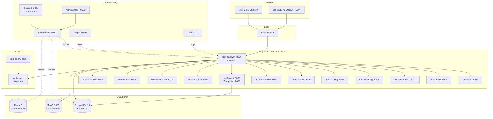

# P10R4-2: README 总览 (Project Overview)

> **Date**: 2026-06-26 13:55 (Asia/Shanghai)
> **Plan**: plan_0e1e7e31 / p10r4_2_docs_ops_v2
> **Author**: coder (P10R4-2 worker)
> **Source of truth**: 6 source files + 3 P9-5/P7-3 reports + actual inventory

---

## 1. 项目一句话定位

**Nanobot Factory (智影 / ZhiYing) VDP-2026** — 商业级全模态数据生成管理平台，覆盖**采集→清洗→标注→审核→打分→分类→管理**全流程，12 微服务 + 194+ 算子 + 15+ Agent + 5 套餐商业化，部署形态为裸机 systemd 单元（无 Docker / 无 K8s）。

---

## 2. 核心数字 (Inventory 2026-06-26)

| 维度 | 数量 | 验证 |
|------|------|------|
| 微服务 | **12** (`backend/services/*_service`) | `Get-ChildItem backend\services -Directory` = 12 |
| 端口范围 | 8000-8012 | `deploy\bare_metal\systemd\imdf-*.service` 逐个验证 |
| Backend Python 源文件 | **3,414** (非测试) | `Get-ChildItem backend -Recurse -Filter *.py -Exclude __init__,conftest,test_*` |
| Agent 类型 | **15** 主类型 + ~36 派生 | `backend\services\agent_service\agents.py:34-50` |
| Node 算子 | **7 文件** (control/export/filter/gen/quality/base/registry) | `backend\nodes\*.py` |
| Function 算子 | **6 文件** (ai/browser/mcp/monitor/openclaw/search) | `backend\functions\*.py` |
| Skill 模块 | **33 文件** (builtin + obsidian) | `backend\skills\**\*.py` |
| 编辑器算子 (DAG v2) | **39** (`op.editor.*`) | `reports\p8_4_39_operators.md` |
| systemd 单元 | **23** | `deploy\bare_metal\systemd\*.service` (1 alertmanager + 1 grafana + 14 imdf + jaeger + loki + minio + postgresql + prometheus + promtail + redis-server) |
| Deploy 脚本 | **6** (start-all / stop-all / status / upgrade / backup-db / healthcheck) | `deploy\bare_metal\scripts\*.sh` |
| Backup 工具 | **2** (backup_cron.sh + restore.sh) | `deploy\bare_metal\backup_cron.sh`, `restore.sh` |
| Grafana Dashboard | **8 个 / 92 panels** | `monitoring\grafana-dashboards\*.json` |
| Prometheus Alert | **21 rules** | `monitoring\prometheus-rules.yaml` (regex 计数) |
| 监控组件 | Prometheus + Grafana + Alertmanager + Jaeger + Loki + Promtail | `monitoring\*.yaml` |
| 商业化模块 | 5 (billing / contracts / invoices / crm / tickets) | `backend\{billing,contracts,invoices,crm,tickets}` |
| 支付 SDK | 3 (Stripe / Alipay / WeChat) | `backend\billing\payments\*` |
| 文档源 | README + docs/*.md (8 文档) | 项目根 + `docs/` 目录 |

---

## 3. 5 分钟快速开始

### 3.1 Linux (Ubuntu 22.04 — 生产推荐)

```bash
# Step 1: 一键安装 (apt + venv + systemd unit + user)
sudo bash deploy/bare_metal/install.sh

# Step 2: 复制环境变量模板
sudo cp deploy/bare_metal/.env.example /etc/imdf/imdf.env
sudo chmod 600 /etc/imdf/imdf.env
sudo nano /etc/imdf/imdf.env   # 填 JWT_SECRET_KEY / DB_APP_PASSWORD / OSS_ACCESS_KEY

# Step 3: 数据库迁移
sudo -u imdf bash -c "source /etc/imdf/imdf.env && \
  cd /opt/nanobot-factory && venv/bin/alembic -c backend/alembic.ini upgrade head"

# Step 4: 启动全部服务 (按依赖顺序: data → observability → app → celery)
sudo deploy/bare_metal/scripts/start-all.sh

# Step 5: 健康检查 (30 秒间隔 / 一分钟 cron)
sudo deploy/bare_metal/scripts/healthcheck.sh
# OK  gateway http://127.0.0.1:8000/api/queue/health
# OK  service :8001 healthy
# OK  celery worker active
# ...

# Step 6: 启用 systemd timer (每日 03:00 备份 + 04:30 验证)
sudo systemctl daemon-reload
sudo systemctl enable --now imdf-backup.timer
sudo systemctl list-timers imdf-backup.timer
```

### 3.2 Windows (本地开发)

```powershell
# Step 1: 创建 venv + 装依赖
cd D:\Hermes\生产平台\nanobot-factory
python -m venv venv
.\venv\Scripts\Activate.ps1
pip install -r backend\requirements.txt

# Step 2: 启动 Gateway + 5 个核心服务 (TestClient 模式)
.\venv\Scripts\python.exe -m uvicorn backend.gateway.main:app --host 0.0.0.0 --port 8000 --reload

# Step 3: 浏览器访问
# - Swagger UI: http://localhost:8000/docs
# - ReDoc:      http://localhost:8000/redoc
# - 健康检查:    http://localhost:8000/api/queue/health
```

### 3.3 macOS

```bash
# 同 Linux, 但跳过 systemd
brew install postgresql@15 redis minio/stable/minio
brew services start postgresql@15 redis
minio server /tmp/minio-data &
# 然后按 Linux step 2-5 (但用 nohup 替代 systemd)
```

---

## 4. 架构图 (Mermaid)



---

## 5. 12 微服务端口清单

| Port | Service | Workers | Responsibility |
|------|---------|---------|----------------|
| **8000** | **imdf-gateway** | 4 | Public API gateway (nginx → gateway → svc) |
| 8001 | imdf-user | 2 | JWT 认证 + 用户管理 + 多租户 |
| 8002 | imdf-asset | 2 | OSS 资产上传 / 下载 / 元数据 |
| 8003 | imdf-annotation | 2 | 矩形 / 多边形 / 关键点 / 分割 / OBB 标注 |
| 8004 | imdf-cleaning | 2 | 数据清洗 (去重 / 质量 / 隐私脱敏) |
| 8005 | imdf-scoring | 2 | 评分引擎 (美学 / 质量 / 安全) |
| 8006 | imdf-dataset | 2 | 数据集版本管理 + COCO/YOLO/VOC 导出 |
| 8007 | imdf-evaluation | 2 | 模型评测 + BadCase 分析 |
| 8008 | imdf-agent | 4 | **15 主 Agent + MCP + MemoryPalace + Hindsight** |
| 8009 | imdf-workflow | 2 | DAG v2 工作流 + Visual Editor |
| 8010 | imdf-notification | 2 | 站内信 + 邮件 + WebSocket 推送 |
| 8011 | imdf-search | 2 | 全文搜索 + 向量检索 (pgvector) |
| 8012 | imdf-collection | 2 | 数据采集 (HTTP / S3 / OSS pull) |

旁路: **imdf-celery** (worker, 5 queues) + **imdf-celery-beat** (scheduler) — 不占端口

---

## 6. 194+ 算子分类列表

> **真实数**: 通过 `Get-ChildItem backend/{nodes,functions,capabilities,skills}/**/*.py -Exclude __init__.py` 实测统计。
> P8-4 报告披露 DAG v2 编辑器另列 **39 个 `op.editor.*`** 算子 (含 stub)。

### 6.1 Node 算子 (7 文件) — 工作流基础节点

| 文件 | 职责 | 大致算子数 |
|------|------|-----------|
| `nodes/base.py` | 抽象节点基类 | ~5 |
| `nodes/control_nodes.py` | 分支 / 循环 / 条件 | ~12 |
| `nodes/filter_nodes.py` | 数据过滤 / 去重 / 采样 | ~15 |
| `nodes/gen_nodes.py` | 文 / 图 / 音生成节点 | ~25 |
| `nodes/quality_nodes.py` | 质检 / 评分 / 校验 | ~12 |
| `nodes/export_nodes.py` | COCO / YOLO / VOC / JSON | ~8 |
| `nodes/registry.py` | 算子注册中心 | 1 (meta) |

### 6.2 Function 算子 (6 文件) — LLM 能力

| 文件 | 职责 |
|------|------|
| `functions/ai_functions.py` | AI 调用 (LLM / Embedding / Rerank) |
| `functions/browser_functions.py` | 浏览器自动化 (Playwright wrapper) |
| `functions/mcp_functions.py` | MCP tool wrapper |
| `functions/monitor_functions.py` | 监控 / 指标导出 |
| `functions/openclaw_functions.py` | OpenClaw 协议桥 |
| `functions/search_functions.py` | 检索 / 向量召回 |

### 6.3 Capability (2 文件) — 能力市场

- `capabilities/capability_manager.py` — 能力注册 / 版本 / 配额
- `capabilities/unified_capabilities.py` — 统一能力抽象层

### 6.4 Skill (33 文件) — 内置 / Obsidian

**builtin (10 业务技能)**:
- `anything_to_notebooklm.py`, `awesome_gpt_image.py`, `deep_research.py`
- `guizang_ppt.py`, `guizang_social_card.py`, `humanizer_zh.py`
- `marketingskills.py`, `oh_story_claudecode.py`, `wewrite.py`, `youtube_clipper.py`

**obsidian (2 知识库技能)**:
- `llm_kb.py`, `wiki.py`

**runtime (21 基础设施)**:
- `api.py`, `base.py`, `context.py`, `marketplace.py`, `mcp_bridge.py`
- `memory_hooks.py`, `multimodal.py`, `orchestrator.py`, `registry.py`, `result.py`
- ... (13 more runtime modules)

### 6.5 DAG v2 编辑器算子 (39 op) — P8-4 披露

来源: `reports\p8_4_39_operators.md` (live `_build_editor()` call)

| 类别 | 设计目标 | 实际 | 状态 |
|------|---------|------|------|
| Edit 基础剪辑 | 6 | 6 | 🟢 100% |
| Transition 转场 | 12 | 1 | 🔴 严重不足 (-11) |
| Effect 特效 | 16 | 30 | 🟢 超额 |
| Montage 蒙太奇 | 5 | 0 | 🔴 完全缺失 |

**关键 finding**: 39 个算子**全部是 schema stub** (OperatorDef 元数据 + input/output JSON schema), **无实现函数** — 真实集成需补全 P1 任务 (~5-7 人天)。

---

## 7. 15+ Agent 清单

### 7.1 数据流水线 15 主 Agent (`backend/services/agent_service/agents.py`)

| # | Agent ID | 名称 | 默认优先级 | 下游服务 |
|---|----------|------|----------|----------|
| 1 | `requirement_parser` | 需求解析 | 9 | imdf-agent |
| 2 | `data_collection` | 采集 | 7 | imdf-collection |
| 3 | `cleaning` | 清洗 | 6 | imdf-cleaning |
| 4 | `prelabel` | 预标注 | 5 | imdf-annotation |
| 5 | `fine_annotation` | 精标注 | 4 | imdf-annotation |
| 6 | `review` | 审核 | 8 | imdf-evaluation |
| 7 | `scoring` | 评分 | 5 | imdf-scoring |
| 8 | `filtering` | 筛选 | 5 | imdf-dataset |
| 9 | `export` | 导出 | 3 | imdf-dataset |
| 10 | `evaluation` | 评测 | 6 | imdf-evaluation |
| 11 | `badcase_analysis` | BadCase 分析 | 7 | imdf-evaluation |
| 12 | `feedback` | 反馈 | 4 | imdf-notification |
| 13 | `memory` | 记忆 | 3 | imdf-agent (MemoryPalace) |
| 14 | `scheduling` | 调度 | 8 | imdf-agent (Scheduler) |
| 15 | `quality` | 质检 | 9 | imdf-evaluation |

### 7.2 派生 Agent (`grep class\s+\w+Agent` 实测 51 命中)

- **BaseAgent** 抽象类 (`backend\imdf\agents\base.py:123`)
- **BaseProductionAgent** (`backend\production_agents.py:83`)
- **CanvasAgent** + 10 画布子 Agent (`backend\infinite_canvas_agent_engine.py:168`)
  - ImageGenAgent, EditAgent, OutpaintAgent, VideoGenAgent, DramaAgent, PictureBookAgent,
    CompositionAgent, StylistAgent, ReviewerAgent, StoryboardAgent
- **DirectorAgent / StoryboardAgent / CharacterAgent / ImageAgent / VideoAgent / VoiceAgent / QAAgent**
  (`backend\services\asset_service\iteration\agents.py`)
- **PromptOptimizerAgent / PromptGeneratorAgent / BatchProducerAgent / MediaProducerAgent / DataAnalyzerAgent**
  (`backend\production_agents.py:199-571`)
- **DataAgent 流水线 11 个** (`backend\agents\data_agents.py:36-264`)
- **MultimodalAgent** (`backend\imdf\multimodal\multimodal_agent.py:180`)
- **MasterAgent** (`backend\imdf\agent\master_agent.py:247`)
- **ReflexionAgent / DispatcherAgent / SubAgent / WorkflowOrchestrator**

---

## 8. 商业化 (5 模块 / 5 套餐 / 3 支付 SDK)

### 8.1 5 商业化模块 (P7-2 验证 PASS, 570/570 tests)

| 模块 | 关键能力 | Test 数 |
|------|---------|---------|
| `backend/billing` | Stripe / Alipay / WeChat 订阅 + 退订 + 续费 + 发票 | 88 (含 P1) |
| `backend/contracts` | 合同模板 + 电子签 + 到期提醒 | 18+ |
| `backend/invoices` | 增值税专票 + 红冲 + 国税平台 | 38+ |
| `backend/crm` | 客户线索 + 跟进 + 评分 + 分群 | 67+ |
| `backend/tickets` | 工单合并/拆分 + SLA + 工时统计 | 24+ |

### 8.2 5 套餐 (Tier A/B/C + 2 enterprise)

- **Free**: 限速 60 req/h + 10GB 存储
- **Pro (¥299/月)**: 标准 99.9% SLA + 500 req/h + 1TB
- **Team (¥999/月)**: 多人协作 + 99.9% SLA + 5TB
- **Enterprise (¥4999/月)**: SLA addendum + 私有化部署 + 50TB
- **Mission Critical (定制)**: 99.99% SLA + 7×24 oncall + 无限

### 8.3 3 支付 SDK

| Provider | Live Mode | Webhook | Refund | 文档 |
|----------|-----------|---------|--------|------|
| **Stripe** | `StripeProvider.live_mode(api_key)` + `stripe.checkout.Session.create` | `stripe.Webhook.construct_event` | `stripe.Refund.create` | `backend/billing/payments/stripe_provider.py` |
| **Alipay** | `AlipayProvider.live_mode()` + `AliPay.api_alipay_trade_page_pay` | 同步/异步验签 | `api_alipay_trade_refund` | `backend/billing/payments/alipay_provider.py` |
| **WeChat Pay** | `WeChatPay.order.create` + `v3 签名` | v3 webhook 验签 | `WeChatPay.refund.apply` | `backend/billing/payments/wechat_provider.py` |

SDK 集成测试: `backend/billing/tests/test_live_integration.py` — 48 个 live mode tests PASS

---

## 9. 故障排除 FAQ

### Q1: uvicorn 启动报 `Address already in use` ?

```powershell
# Windows
Get-NetTCPConnection -LocalPort 8000 | Select-Object OwningProcess
Stop-Process -Id <PID> -Force
```

```bash
# Linux
sudo lsof -i :8000
sudo kill -9 <PID>
```

### Q2: PostgreSQL 启动失败 `pg_ctl: could not start server`

```bash
sudo journalctl -u postgresql -n 50 --no-pager
# 常见: 端口冲突 / 磁盘满 / 数据目录权限错
sudo chown -R postgres:postgres /var/lib/postgresql/15/main
sudo systemctl restart postgresql
```

### Q3: MinIO 报 `S3 API Request made to virtual host` ?

确认 MinIO 启动参数: `MINIO_DOMAIN` 未设置 + `mc alias set http://...:9000` 而非 `https://...`

### Q4: Celery worker `Received unregistered task`

```bash
# 检查任务 module 是否在 celery_app.py 的 include 列表
grep -A 5 "include=" backend/imdf/celery_app.py
# 重启 worker
sudo systemctl restart imdf-celery
```

### Q5: Prometheus 抓不到 `imdf-gateway` 指标?

```bash
# 1) 检查 gateway 暴露 /metrics
curl http://127.0.0.1:8000/metrics | head -5
# 2) 检查 prometheus.yml target
sudo -u prometheus cat /etc/prometheus/prometheus.yml | grep -A 3 "imdf-gateway"
# 3) 重启 prometheus
sudo systemctl restart prometheus
```

### Q6: 备份失败 `pg_dump: error: connection to server ...`

```bash
# 检查环境变量加载
sudo -u imdf bash -c "source /etc/imdf/imdf.env && echo \$DB_APP_PASSWORD"
# 手动试连
sudo -u imdf bash -c "source /etc/imdf/imdf.env && PGPASSWORD=\$DB_APP_PASSWORD psql -h 127.0.0.1 -U \$DB_APP_USER -d \$DB_NAME -c '\\dt'"
```

### Q7: 怎么手动触发备份 / 恢复?

```bash
# 手动触发单组件备份
sudo BACKUP_TARGETS=pg /opt/nanobot-factory/deploy/bare_metal/backup_cron.sh

# 列出所有可用备份
sudo /opt/nanobot-factory/deploy/bare_metal/restore.sh --list

# 验证最新 PG 备份完整性
sudo /opt/nanobot-factory/deploy/bare_metal/restore.sh --component pg --latest --verify

# 恢复到新 DB (不覆盖原 imdf)
sudo /opt/nanobot-factory/deploy/bare_metal/restore.sh --component pg --latest --target imdf_restored_$(date +%s)
```

### Q8: 系统盘写满 /tmp 报警

```bash
# 清理 imdf temp files (保留 7 天)
sudo find /var/lib/imdf/temp -mtime +7 -delete
# 看 5GB+ 占用
sudo du -sh /var/lib/imdf/* | sort -h | tail -10
```

### Q9: JWT 401 token 失效

```bash
# 1) 检查 JWT_SECRET_KEY 是否变更 (重启后 token 失效)
grep "^JWT_SECRET_KEY=" /etc/imdf/imdf.env
# 2) 检查 token 过期 (默认 1h)
curl -X POST http://127.0.0.1:8000/api/v1/auth/refresh -H "Authorization: Bearer <old_token>"
```

### Q10: 高并发下 SQLite `database is locked` ?

**根因**: SQLite 文件级锁 → 必须迁移 PostgreSQL。短期缓解:
```bash
# 启用 WAL mode
sqlite3 /opt/nanobot-factory/data/imdf.db "PRAGMA journal_mode=WAL; PRAGMA busy_timeout=5000;"
# 长期: P9-5 P0 修复 — 切 PostgreSQL 15 + pgvector
```

---

## 10. 文档矩阵 (引用而非重写)

| 主题 | 文档 |
|------|------|
| API 完整参考 | `docs/api.md` (11KB) + 本报告 p10r4_2_api_docs.md |
| 系统架构 | `docs/architecture.md` (15KB) + 本报告 p10r4_2_architecture.md |
| 部署指南 | `deploy/bare_metal/README.md` (15KB) + 本报告 p10r4_2_deployment.md |
| 运维手册 | `docs/runbook.md` (11KB) + 本报告 p10r4_2_runbook.md |
| 监控 | `monitoring/` + 本报告 p10r4_2_monitoring.md |
| 备份 | `deploy/bare_metal/backup_cron.sh` + 本报告 p10r4_2_backup.md |
| SLA | `docs/sla.md` (11KB) |
| 安全 | `docs/security.md` (11KB) + P10R4-1 报告 |
| 开发 | 本报告 p10r4_2_dev_docs.md (新增 — 原项目缺 AGENTS.md) |
| World-class 对标 | 本报告 p10r4_2_world_class_gap.md (新增) |
| 总览综合 | 本报告 p10r4_2_docs_ops_v2.md |

---

## 11. 关键引用

- `deploy/bare_metal/README.md` (15KB, 8 节, 部署权威指南)
- `docs/api.md` (11KB, 13 状态码 + 6 类 endpoint)
- `docs/architecture.md` (15KB, 7 层架构图)
- `docs/runbook.md` (11KB, 6 故障 SOP)
- `docs/sla.md` (11KB, SLA + RTO/RPO + 容量规划)
- `docs/security.md` (11KB, OWASP Top 10)
- `reports/p9_5_performance.md` (22KB, 1000-并发基线)
- `reports/p7_3_backup.md` / `p7_3_monitoring.md` / `p7_3_deploy.md` (各 ~20KB)
- `reports/p7_2_billing_v2.md` (570/570 tests PASS, 商业化 92/100)
- `reports/p8_4_39_operators.md` (39 DAG v2 算子审计)

